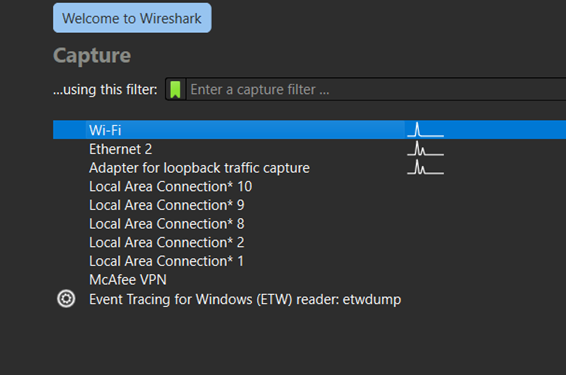
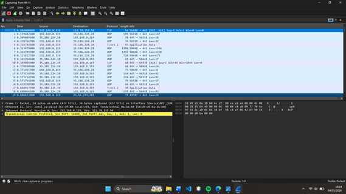
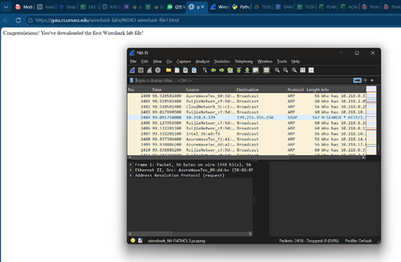
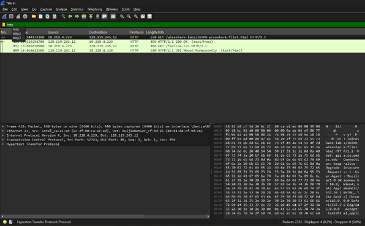

# Laporan Praktikum Jaringan Komputer - Modul 2
## Pengenalan Tools (Wireshark)

### Identitas Praktikan
| Item | Keterangan |
|------|------------|
| **Nama** | YOHANNA PURNOMO |
| **NIM** | 103072400127 |
| **Kelas** | IF-04-01 |

---

# 1. Tujuan Praktikum

Berdasarkan modul praktikum Jaringan Komputer, tujuan dari Modul 2 adalah:

1. Mahasiswa dapat melakukan instalasi tools yang digunakan yaitu Wireshark.
2. Mahasiswa dapat menggunakan Wireshark untuk menangkap (capture) dan mengidentifikasi paket data jaringan.

---

# 2. Dasar Teori

Wireshark adalah aplikasi **packet sniffer** yang digunakan untuk menangkap dan menganalisis lalu lintas jaringan komputer.

Packet sniffer bekerja dengan cara menerima salinan frame yang dikirim atau diterima oleh komputer melalui interface jaringan seperti **WiFi atau Ethernet**.

Dalam proses komunikasi jaringan, data yang dikirim melalui internet akan melewati beberapa layer dalam model jaringan, antara lain:

- **Ethernet** → Link Layer  
- **Internet Protocol (IP)** → Network Layer  
- **TCP / UDP** → Transport Layer  
- **HTTP, DNS, dan lainnya** → Application Layer  

Wireshark mampu menampilkan informasi detail dari setiap layer tersebut sehingga memudahkan proses analisis jaringan.

---

# 3. Langkah Praktikum

Langkah-langkah yang dilakukan pada praktikum Modul 2 adalah sebagai berikut:

1. Menjalankan aplikasi **Wireshark**.
2. Memilih **interface jaringan** yang sedang aktif (WiFi atau Ethernet).
3. Memulai proses **capture paket jaringan**.
4. Membuka browser dan mengakses website berikut:[Wireshark Labs Intro](http://gaia.cs.umass.edu/wireshark-labs/INTRO-wireshark-file1.html)
5. Menghentikan proses capture setelah halaman berhasil dimuat.
6. Menggunakan **Display Filter** pada Wireshark dengan mengetik: http

untuk menampilkan hanya paket HTTP.

---

# 4. Hasil dan Pembahasan

## 4.1 Memulai Capture Paket

Berikut adalah tampilan saat memulai proses capture paket pada Wireshark dengan memilih interface jaringan yang aktif.

*Gambar 0: Tampilan awal Wireshark saat pertama kali dibuka sebelum melakukan capture paket. Terlihat daftar interface jaringan yang tersedia.
  
*Gambar 1: Tampilan Wireshark saat memulai proses capture paket.*

---

## 4.2 Mengakses Website

Setelah proses capture dimulai, praktikan membuka browser dan mengakses website praktikum dari University of Massachusetts.

  
*Gambar 2: Akses website wireshark labs melalui browser.*

---

## 4.3 Filter HTTP

Setelah proses capture dihentikan, digunakan **Display Filter HTTP** untuk menampilkan paket yang menggunakan protokol HTTP.

  
*Gambar 3: Hasil filter paket HTTP pada Wireshark.*

---

# 5. Analisis Singkat

Dari hasil pengamatan menggunakan Wireshark dapat diketahui bahwa:

- Setiap akses website melibatkan proses **HTTP Request** dan **HTTP Response**.
- Protokol **HTTP berjalan di atas TCP** sebagai transport layer.
- Paket data yang dikirim melalui jaringan terdiri dari beberapa layer seperti **Ethernet, IP, TCP, dan HTTP**.
- Wireshark memungkinkan pengguna melihat detail dari setiap paket yang dikirim maupun diterima oleh komputer.

---

# 6. Kesimpulan

Berdasarkan praktikum Modul 2 yang telah dilakukan, dapat disimpulkan bahwa:

1. Praktikan berhasil menggunakan Wireshark untuk melakukan **capture paket jaringan**.
2. Praktikan dapat mengidentifikasi paket menggunakan **Display Filter HTTP**.
3. Praktikan memahami bahwa komunikasi website melibatkan pertukaran **HTTP request dan response**.
4. Praktikum ini membantu memahami bagaimana data dikirim melalui beberapa layer jaringan seperti **Ethernet, IP, TCP, dan HTTP**.
