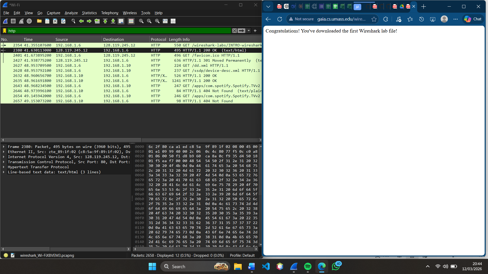
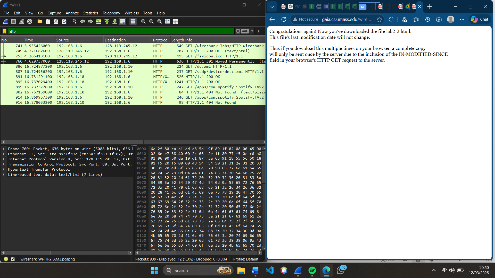
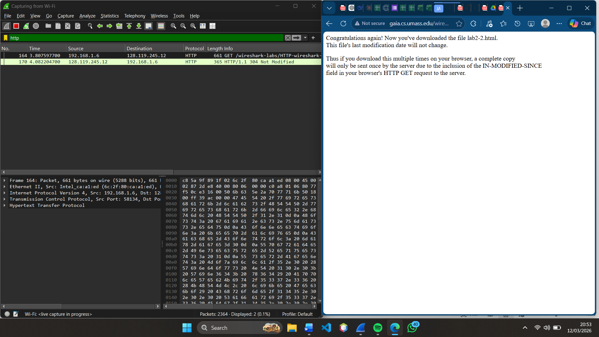
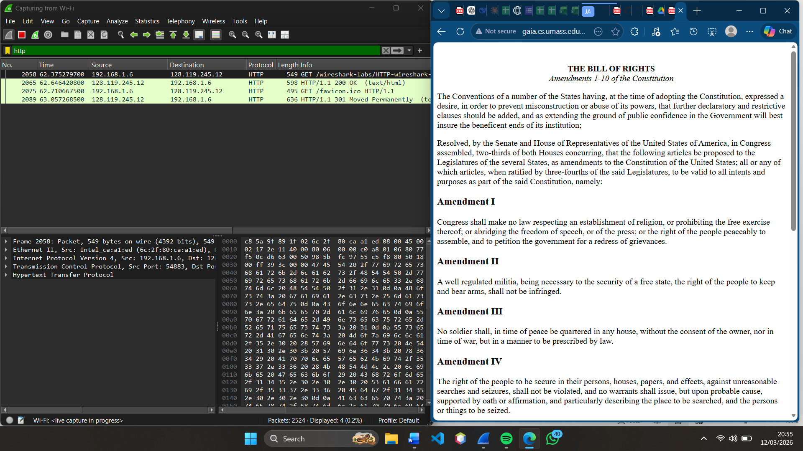
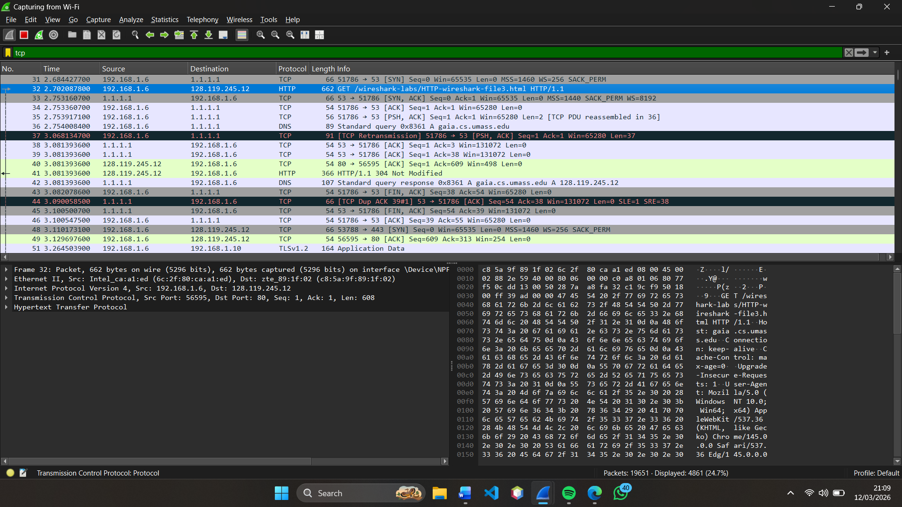
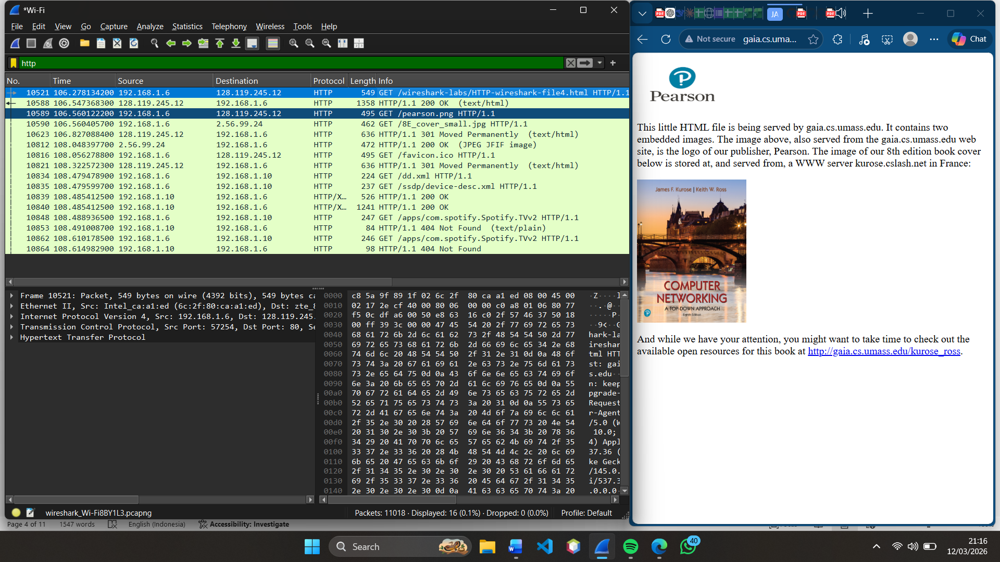
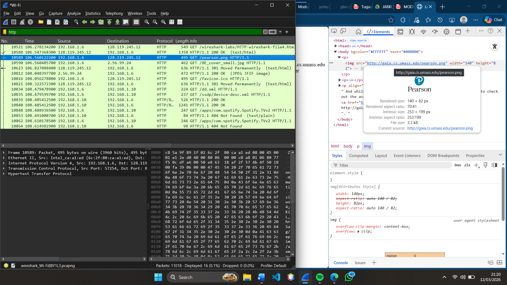
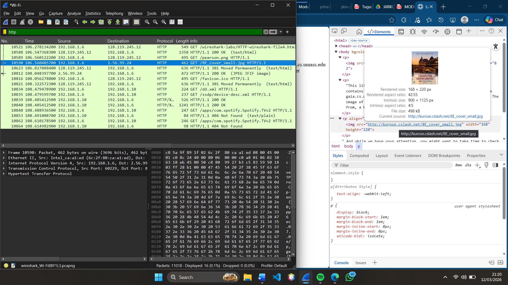
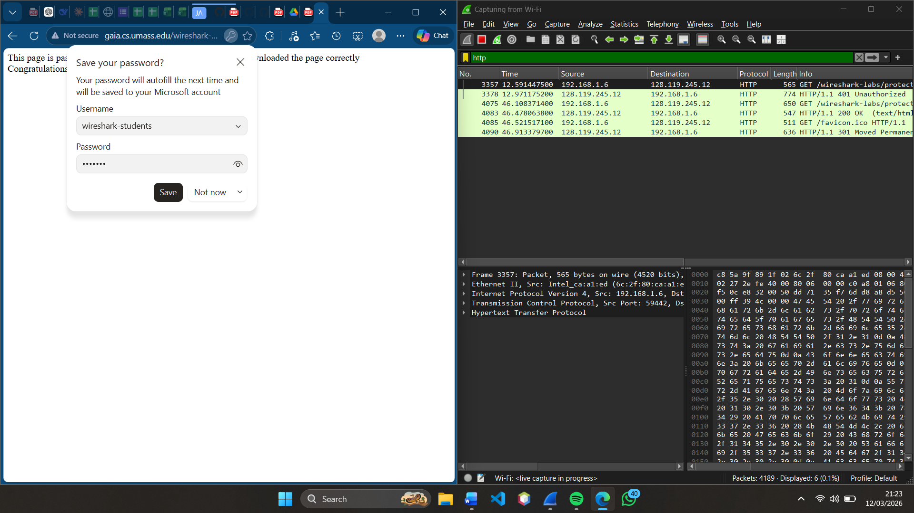
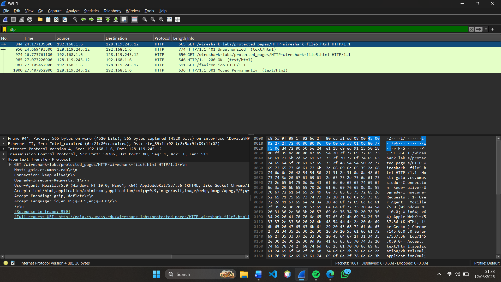

# Laporan Praktikum Jaringan Komputer - Modul 3
## Analisis Protokol HTTP Menggunakan Wireshark

### Identitas Praktikan

| Item | Keterangan |
|------|------------|
| **Nama** | YOHANNA PURNOMO |
| **NIM** | 103072400127 |
| **Kelas** | IF-04-01 |

---

# 1. Tujuan Praktikum

Berdasarkan modul praktikum Jaringan Komputer, tujuan dari Modul 3 adalah:

1. Memahami cara kerja **HTTP Request dan Response** pada komunikasi web.
2. Menggunakan **Wireshark** untuk menangkap dan menganalisis paket HTTP pada jaringan.
3. Mengamati berbagai **status code HTTP** seperti 200 OK, 301 Moved Permanently, dan 304 Not Modified.
4. Memahami konsep **browser caching** dalam komunikasi HTTP.
5. Mengamati bagaimana **dokumen HTML berukuran besar dikirim menggunakan beberapa segmen TCP**.
6. Mengetahui bahwa **HTTP authentication tidak aman karena tidak menggunakan enkripsi**.

---

# 2. Dasar Teori

Hypertext Transfer Protocol (HTTP) merupakan protokol komunikasi yang digunakan antara **web browser (client)** dan **web server** untuk mengirim serta menerima data pada jaringan internet.

Ketika pengguna membuka suatu website, browser akan mengirimkan **HTTP Request** kepada server untuk meminta resource seperti file HTML, gambar, CSS, atau JavaScript. Server kemudian memberikan **HTTP Response** yang berisi data yang diminta beserta status code tertentu.

Beberapa status code HTTP yang umum digunakan antara lain:

- **200 OK** → Permintaan berhasil diproses oleh server.
- **301 Moved Permanently** → Halaman dipindahkan ke alamat baru.
- **304 Not Modified** → File tidak berubah sehingga browser menggunakan cache yang tersimpan.

HTTP berjalan di atas protokol **TCP (Transmission Control Protocol)** yang bertugas memastikan pengiriman data berjalan secara andal. Jika ukuran data cukup besar, maka server akan membagi data menjadi beberapa **segmen TCP** sebelum dikirimkan ke client.

Selain itu HTTP juga dapat menggunakan **authentication** untuk proses login. Namun pada HTTP biasa, username dan password hanya di-*encode* tanpa enkripsi sehingga informasi tersebut masih dapat dibaca melalui proses sniffing jaringan.

---

# 3. Langkah Praktikum

Langkah-langkah yang dilakukan pada praktikum Modul 3 adalah sebagai berikut:

1. Membuka aplikasi **Wireshark**.
2. Memilih **interface jaringan yang aktif (WiFi)**.
3. Memulai proses **capture paket jaringan**.
4. Membuka browser dan mengakses website praktikum Wireshark Labs.
5. Menghentikan proses capture setelah halaman berhasil dimuat.
6. Menggunakan **Display Filter HTTP** pada Wireshark untuk menampilkan paket HTTP.

Website yang digunakan pada praktikum ini adalah: [web](http://gaia.cs.umass.edu/wireshark-labs/)

---

# 4. Hasil dan Pembahasan

---

# 4.1 Percobaan 3.1 – HTTP GET Request

Pada percobaan pertama dilakukan pengamatan terhadap proses **HTTP GET Request** yang dikirim oleh browser ketika mengakses halaman web.

Langkah yang dilakukan:

1. Menjalankan Wireshark dan memulai proses capture paket.
2. Membuka browser dan mengakses halaman **wireshark-file1.html**.
3. Menghentikan proses capture setelah halaman selesai dimuat.
4. Menggunakan filter berikut pada Wireshark: http

Filter tersebut digunakan untuk menampilkan paket yang menggunakan protokol HTTP.

Dari hasil pengamatan terlihat bahwa browser mengirimkan **HTTP GET Request** kepada server untuk meminta file HTML. Server kemudian memberikan respon berupa **HTTP Response 200 OK** yang menandakan bahwa permintaan berhasil diproses.

*Gambar 1: HTTP Response dari server dengan status code 200 OK.*

---

# 4.2 Percobaan 3.2 – Browser Caching

Pada percobaan ini dilakukan pengamatan terhadap mekanisme **cache pada browser**.

Langkah yang dilakukan:

1. Menghapus cache browser dengan menekan: CTRL + SHIFT + DELETE
2. Menghapus **Cached Images and Files** serta **Browsing History**.
3. Memulai capture paket pada Wireshark.
4. Mengakses halaman **wireshark-file2.html**.

Dari hasil pengamatan terlihat adanya status code HTTP seperti:

- **301 Moved Permanently**
- **304 Not Modified**

*Gambar 2: Paket HTTP dengan status code 301 Moved Permanently.*

*Gambar 3: Paket HTTP dengan status code 304 Not Modified.*

Status **304 Not Modified** menunjukkan bahwa file tidak mengalami perubahan sehingga browser menggunakan file yang telah tersimpan pada cache tanpa harus mengunduh ulang dari server.

---

# 4.3 Percobaan 3.3 – Transfer Dokumen HTML Panjang

Pada percobaan ini diamati bagaimana server mengirimkan dokumen HTML yang berukuran besar.

Langkah yang dilakukan:

1. Menghapus cache browser terlebih dahulu.
2. Memulai proses capture pada Wireshark.
3. Mengakses halaman **wireshark-file3.html**.
4. Mengamati paket TCP yang muncul setelah HTTP Response.

Dari hasil pengamatan terlihat bahwa dokumen HTML yang berukuran besar tidak dikirim dalam satu paket saja, melainkan dipecah menjadi beberapa **segmen TCP**.

Pada Wireshark terlihat beberapa paket dengan keterangan: 
TCP Segment of a reassembled PDU

Hal ini menunjukkan bahwa data HTML tersebut merupakan bagian dari satu file yang dikirim melalui beberapa segmen TCP kemudian **disusun kembali oleh browser** sehingga halaman web dapat ditampilkan dengan lengkap.

*Gambar 5: Proses pengiriman dokumen HTML menggunakan beberapa segmen TCP.*

---

# 4.4 Percobaan 3.4 – HTTP Request untuk Objek Gambar

Pada percobaan ini diamati bahwa satu halaman web tidak hanya terdiri dari satu file HTML, tetapi juga terdiri dari beberapa objek seperti gambar.

Langkah yang dilakukan:

1. Menghapus cache browser.
2. Memulai capture pada Wireshark.
3. Mengakses halaman **wireshark-file4.html**.
4. Mengamati paket request yang dikirim oleh browser.

Dari hasil pengamatan terlihat bahwa selain file HTML utama, browser juga mengirimkan request tambahan untuk mengambil file gambar seperti:
person.png
person-small.jpg

Setiap objek pada halaman web menghasilkan **HTTP GET Request yang berbeda**.

*Gambar 6: HTTP GET Request untuk file gambar.*

*Gambar 7: crosscheck file nya sama.*

*Gambar 8: crosscheck file nya sama.*
---

# 4.5 Percobaan 3.5 – HTTP Authentication

Pada percobaan terakhir diamati proses **HTTP Authentication**.

Langkah yang dilakukan:

1. Memulai capture paket pada Wireshark.
2. Mengakses halaman **wireshark-file5.html**.
3. Memasukkan username dan password berikut:
user: wireshark-students
pass : network

*Gambar 9: Mengakses halaman wireshark-file5.html. Memasukkan username dan password berikut: user: wireshark-students pass : network.*

*Gambar 10: Informasi Authorization Basic pada paket HTTP.*

Hal ini menunjukkan bahwa username dan password dikirim dalam bentuk **encoding Base64** tanpa enkripsi sehingga informasi tersebut dapat dibaca oleh pihak yang menangkap paket jaringan.

---

# 5. Analisis Singkat

Dari hasil praktikum menggunakan Wireshark dapat diketahui bahwa:

- Browser menggunakan metode **HTTP GET** untuk meminta resource dari server.
- Server memberikan respon berupa **HTTP Response** dengan status code tertentu.
- Browser memanfaatkan **cache** untuk mempercepat proses akses halaman web.
- Data yang berukuran besar dikirim menggunakan **beberapa segmen TCP**.
- Halaman web biasanya terdiri dari beberapa objek seperti **HTML, gambar, CSS, dan JavaScript**.
- HTTP authentication tidak aman karena informasi login tidak dienkripsi.

---

# 6. Kesimpulan

Berdasarkan praktikum Modul 3 yang telah dilakukan, dapat disimpulkan bahwa:

1. Wireshark dapat digunakan untuk menganalisis komunikasi HTTP antara client dan server.
2. Proses akses website melibatkan pertukaran **HTTP request dan HTTP response**.
3. Browser menggunakan **cache** untuk mengurangi penggunaan bandwidth serta mempercepat akses halaman.
4. File yang berukuran besar dikirim melalui jaringan dengan cara **memecahnya menjadi beberapa segmen TCP**.
5. HTTP authentication tidak aman karena username dan password dapat terlihat pada paket jaringan.