# Laporan Praktikum Jaringan Komputer - Modul 4 
## Analisis Protokol DNS Menggunakan Wireshark

### Identitas Praktikan

| Item | Keterangan |
|------|------------|
| **Nama** | YOHANNA PURNOMO |
| **NIM** | 103072400127 |
| **Kelas** | IF-04-01 |

---

# MODUL 4 — DNS

# 1. Tujuan Praktikum

Berdasarkan modul praktikum Jaringan Komputer, tujuan dari Modul 4 adalah:

1. Memahami cara kerja **Domain Name System (DNS)** dalam menerjemahkan nama host ke alamat IP.
2. Menggunakan perintah **nslookup** untuk melakukan query DNS secara manual.
3. Menggunakan perintah **ipconfig** untuk mengelola cache DNS pada komputer.
4. Menggunakan **Wireshark** untuk menangkap dan menganalisis paket DNS pada jaringan.

---

# 2. Dasar Teori

Domain Name System (DNS) merupakan sistem yang bertugas menerjemahkan nama host (seperti `www.google.com`) menjadi alamat IP (seperti `142.250.185.46`) yang dapat dipahami oleh mesin. DNS bekerja secara hierarkis menggunakan berbagai jenis server, mulai dari **DNS root**, **TLD server**, hingga **authoritative DNS server**.

Pada sisi klien, query DNS dikirimkan ke **DNS resolver lokal** menggunakan protokol **UDP port 53**. Proses ini berjalan secara transparan di balik layar setiap kali pengguna mengakses suatu website.

Beberapa tool yang digunakan dalam modul ini antara lain:
- **nslookup** — untuk melakukan query DNS manual ke server DNS tertentu
- **ipconfig** — untuk mengelola konfigurasi jaringan dan cache DNS (Windows)
- **Wireshark** — untuk menangkap dan menganalisis paket DNS secara langsung

---

# 3. Langkah Praktikum

Langkah-langkah umum yang dilakukan pada praktikum Modul 4:

1. Membuka **Command Prompt** (Windows) atau **Terminal** (Linux/Mac).
2. Menggunakan perintah **nslookup** untuk melakukan berbagai jenis DNS query.
3. Menggunakan perintah **ipconfig** untuk melihat dan mengelola cache DNS.
4. Membuka **Wireshark**, memulai capture, dan mengunjungi `http://www.ietf.org`.
5. Menganalisis paket DNS yang tertangkap untuk menjawab pertanyaan-pertanyaan.

---

# 4. Hasil dan Pembahasan

---

## 4.2  — NSLOOKUP

### nslookup www.mit.edu

1. Buka **Command Prompt**
2. Ketik perintah berikut lalu tekan Enter:
   ```
   nslookup www.mit.edu
   ```
3. Amati output yang ditampilkan

> 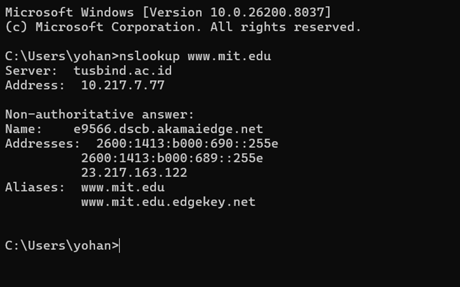
> *Gambar 1 Hasil perintah `nslookup www.mit.edu` di Command Prompt*

Dari hasil perintah `nslookup www.mit.edu`, dapat dilihat bahwa DNS server lokal berhasil mengembalikan **alamat IP dari www.mit.edu**. Output menampilkan nama server DNS yang memberikan jawaban beserta alamat IP tujuan.

---

###  nslookup -type=NS mit.edu

1. Di Command Prompt, ketik perintah berikut:
   ```
   nslookup -type=NS mit.edu
   ```
2. Tekan Enter dan amati hasilnya

> 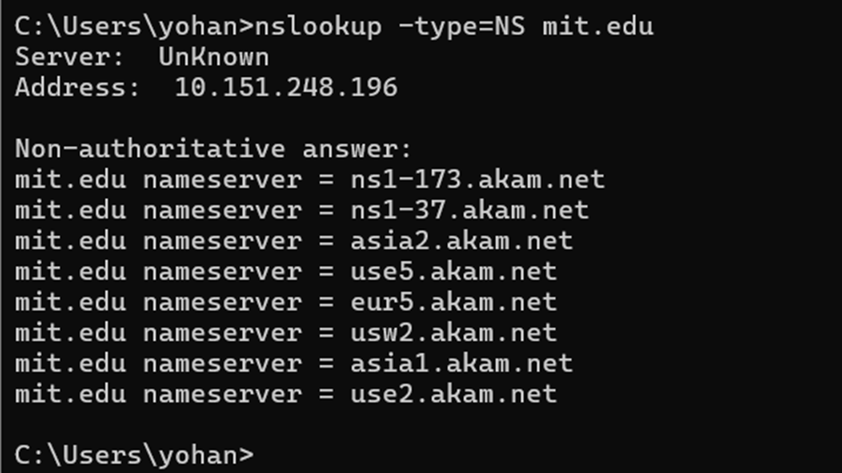
> *Gambar 2 : Hasil perintah `nslookup -type=NS mit.edu`*

Perintah ini menggunakan opsi `-type=NS` untuk meminta record tipe NS (Name Server). Output menampilkan daftar **authoritative DNS server** untuk domain `mit.edu`.

---

### Pengujian Mandiri nslookup

**Instruksi dari modul:** Jalankan beberapa hal berikut dan amati hasilnya.

---

#### nslookup untuk server web di Asia

1. Di Command Prompt, ketik:
   ```
   nslookup www.korea.ac.kr/en/index.do
   ```
   *(www.korea.ac.kr/en/index.do adalah server web Korea University)*

> 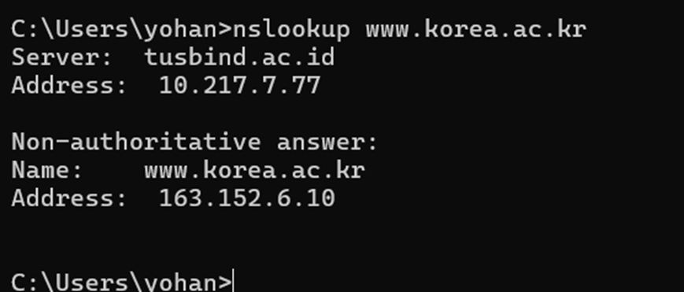
> *Gambar 3 : Hasil `nslookup www.ust.hk` menampilkan alamat IP server di Asia*

**Jawaban:** Alamat IP server web di Asia (www.korea.ac.kr/en/index.do) dapat dilihat pada bagian "Address" di output nslookup.

---

####  nslookup untuk server DNS otoritatif universitas di Eropa

1. Di Command Prompt, ketik:
   ```
   nslookup -type=NS www.ox.ac.uk
   ```
   *(www.ox.ac.uk adalah website Oxford University)*

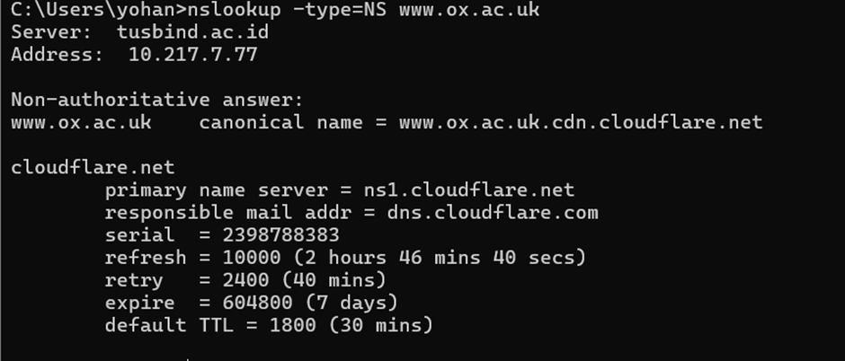
> *Gambar 4: Hasil `nslookup -type=NS www.ox.ac.uk` menampilkan authoritative DNS server*


**Jawaban:** Output menampilkan nama-nama server DNS otoritatif untuk universitas Oxford di Eropa beserta alamat IP-nya.

---

####  nslookup untuk server email Yahoo! Mail


1. Di Command Prompt, ketik:
   ```
   nslookup -type=MX 
   ```

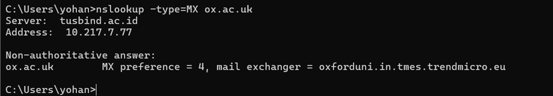
> *Gambar 5: Hasil `nslookup -type=MX ` menampilkan mail server*

**Jawaban:** Perintah `-type=MX` digunakan untuk mencari **Mail Exchange record**. Output menampilkan nama dan alamat IP dari server.

---

## 4.3 IPCONFIG

### ipconfig /all

**Langkah yang dilakukan:**

1. Buka Command Prompt
2. Ketik perintah:
   ```
   ipconfig /all
   ```

>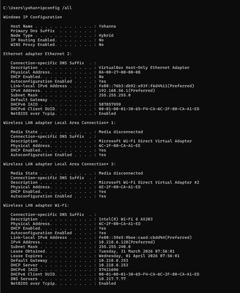
> *Gambar 6 : Hasil `ipconfig /all` menampilkan konfigurasi jaringan lengkap*


Perintah `ipconfig /all` menampilkan semua informasi konfigurasi jaringan termasuk **alamat IP, subnet mask, default gateway, dan alamat DNS server lokal**.

---

### ipconfig /displaydns

1. Di Command Prompt, ketik:
   ```
   ipconfig /displaydns
   ```

>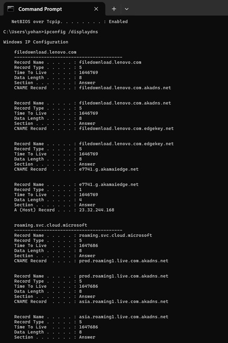
> *Gambar 7 : Hasil `ipconfig /displaydns` menampilkan isi DNS cache*


Perintah ini menampilkan semua record DNS yang saat ini tersimpan dalam **DNS cache lokal** komputer beserta sisa waktu TTL (Time To Live) masing-masing.

---

### ipconfig /flushdns

1. Di Command Prompt (jalankan sebagai Administrator), ketik:
   ```
   ipconfig /flushdns
   ```

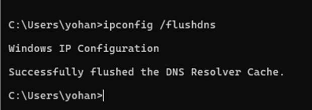
> *Gambar 8 : Hasil `ipconfig /flushdns` — cache DNS berhasil dikosongkan*


Perintah ini **mengosongkan seluruh DNS cache** pada komputer. Setelah dijalankan, muncul konfirmasi bahwa DNS Resolver Cache telah berhasil dihapus.

---

## 4.4 TRACING DNS DENGAN WIRESHARK

Pada bagian ini dilakukan pengamatan paket DNS menggunakan Wireshark saat browser mengakses `http://www.ietf.org`.

### Langkah Persiapan:

1. Buka Command Prompt → ketik `ipconfig /flushdns` untuk mengosongkan DNS cache
2. Buka browser → tekan `Ctrl + Shift + Delete` → hapus cache dan history browser
3. Buka **Wireshark** → pilih interface jaringan yang aktif (WiFi/Ethernet)
4. Di kolom filter Wireshark, masukkan filter berikut (ganti dengan IP komputer kamu dari ipconfig):
   ```
   ip.addr == [IP_KAMU]
   ```
5. Klik tombol **Start Capture** (tombol sirip hiu biru)
6. Buka browser → akses `http://www.ietf.org`
7. Tunggu hingga halaman selesai dimuat sepenuhnya
8. Kembali ke Wireshark → klik tombol **Stop Capture** (kotak merah)

> 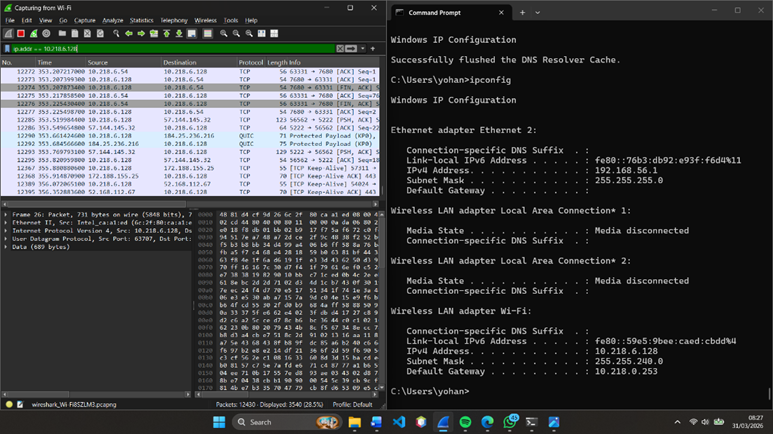
> *Gambar 9 : Tampilan Wireshark saat mulai capture dengan filter ip.addr*


> 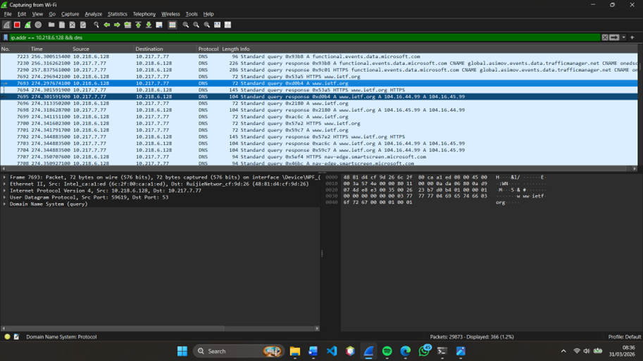
> *Gambar 10: Tampilan Wireshark setelah stop capture — terlihat banyak paket tertangkap*

---

### Pertanyaan 1 — Protokol Transport DNS

**Soal:** Cari pesan permintaan DNS dan balasannya. Apakah pesan tersebut dikirimkan melalui UDP atau TCP?

> 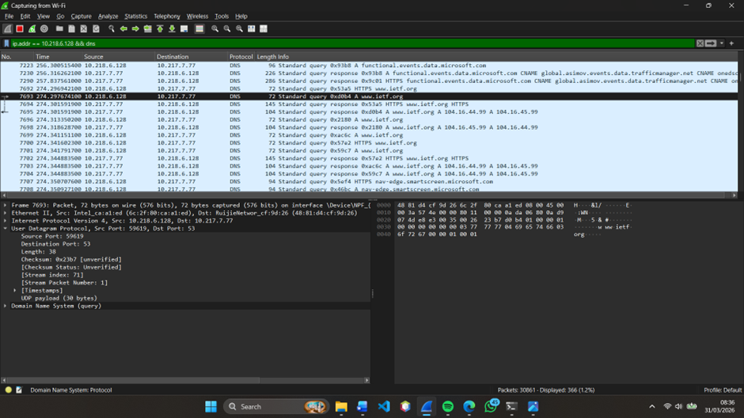
> *Gambar11: Paket DNS di Wireshark dengan filter `dns` aktif — tampilkan kolom Protocol dan detail paket*

**JAWAB:** Pesan DNS dikirimkan melalui **UDP (User Datagram Protocol)**. Hal ini terlihat dari kolom "Protocol" yang menampilkan "DNS" dan ketika di-expand di panel detail, terdapat bagian "User Datagram Protocol" yang menunjukkan paket DNS dibawa oleh UDP.

---

### Pertanyaan 2 — Port Tujuan dan Port Sumber DNS

**Soal:** Apa port tujuan pada pesan permintaan DNS? Apa port sumber pada pesan balasannya?

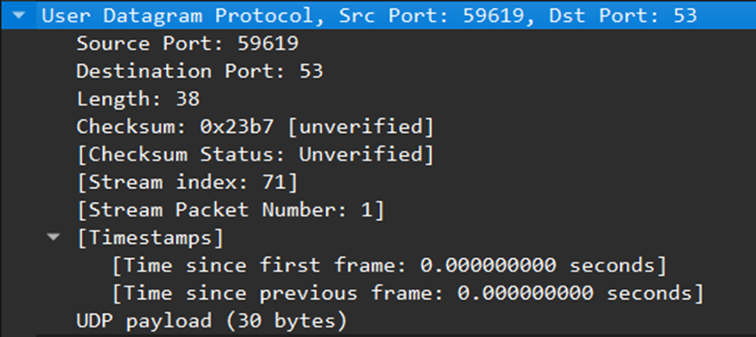
> *Gambar 12: Detail paket DNS Query — tampilkan Source Port dan Destination Port*

**JAWAB:** Port tujuan pada pesan permintaan DNS adalah **port 53**. Port sumber pada pesan balasan DNS juga **port 53**. Port 53 adalah port standar yang digunakan oleh layanan DNS.

---

### Pertanyaan 3 — Alamat IP Tujuan DNS vs DNS Server Lokal

**Soal:** Pada pesan permintaan DNS, apa alamat IP tujuannya? Apa alamat IP server DNS lokal anda? Apakah kedua alamat IP tersebut sama?

> 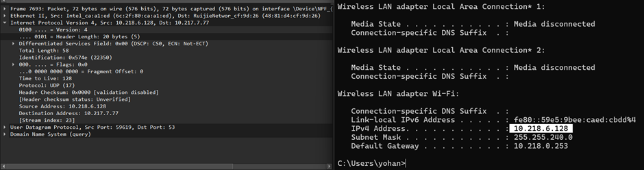
> *Gambar 13: Detail DNS Query menampilkan Destination IP di bagian "Internet Protocol Version 4"*


**JAWAB:** Alamat IP tujuan pada pesan permintaan DNS adalah sama dengan alamat IP **DNS server lokal** yang diperoleh dari `ipconfig /all`. Hal ini wajar karena DNS query dikirimkan langsung ke DNS resolver lokal yang kemudian meneruskan query ke server DNS yang lebih tinggi jika diperlukan.

---

### Pertanyaan 4 — Tipe dan Isi Pesan Permintaan DNS

**Soal:** Periksa pesan permintaan DNS. Apa "jenis" atau "type" dari pesan tersebut? Apakah pesan permintaan tersebut mengandung "jawaban" atau "answers"?

> 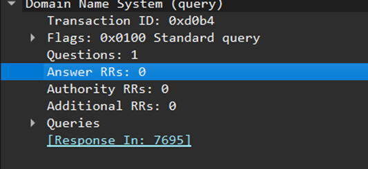
> *Gambar 14: Detail DNS Query — expand "Domain Name System" dan tampilkan field Type dan Answers*

**JAWAB:** Tipe dari pesan permintaan DNS adalah **A (Host Address)** yang berarti browser meminta alamat IPv4 dari domain yang dituju. Pesan permintaan DNS **TIDAK mengandung jawaban (answers = 0)** karena permintaan ini hanya berisi pertanyaan/query yang dikirim ke DNS server, belum ada jawaban di dalamnya.

---

### Pertanyaan 5 — Jumlah dan Isi Jawaban DNS Reply

**Soal:** Periksa pesan balasan DNS. Berapa banyak "jawaban" atau "answers" yang terdapat di dalamnya? Apa saja isi yang terkandung dalam setiap jawaban tersebut?

1. Filter: `dns`
2. Klik paket **DNS Response** (balasan) — biasanya terlihat "Standard query response"
3. Expand "Domain Name System (response)" → expand bagian "Answers"
4. Hitung dan catat semua answers yang ada

>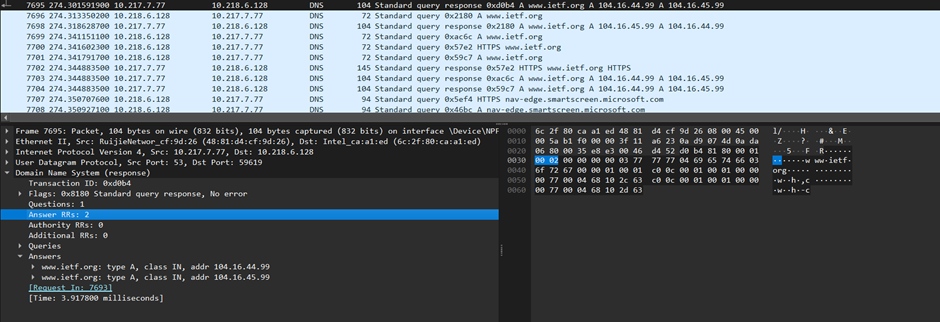
> *Gambar 15: Detail DNS Response — expand "Answers" dan tampilkan semua record yang ada*

**JAWAB:** Pesan balasan DNS mengandung beberapa **answers** yang berisi mapping antara nama domain dengan alamat IP-nya. Setiap answer berisi informasi seperti: nama domain, tipe record (A/CNAME), TTL (Time To Live), dan alamat IP yang bersangkutan. Jumlah answers bisa berbeda-beda tergantung konfigurasi server.

---

### Pertanyaan 6 — Paket TCP SYN vs IP dari DNS Reply

**Soal:** Perhatikan paket TCP SYN yang selanjutnya dikirimkan oleh host Anda. Apakah alamat IP pada paket tersebut sesuai dengan alamat IP yang tertera pada pesan balasan DNS?

**Langkah untuk menjawab:**

1. Dari pertanyaan 5, catat **alamat IP** yang ada di DNS Answer 
2. Di Wireshark, ganti filter ke:
   ```
   tcp.flags.syn == 1 && tcp.flags.ack == 0
   ```
3. Tekan Enter — ini menampilkan hanya paket TCP SYN murni (bukan SYN-ACK)
4. Klik paket TCP SYN pertama yang muncul
5. Di panel detail, expand **"Internet Protocol Version 4"**
6. Catat nilai field **"Destination"**
7.

> 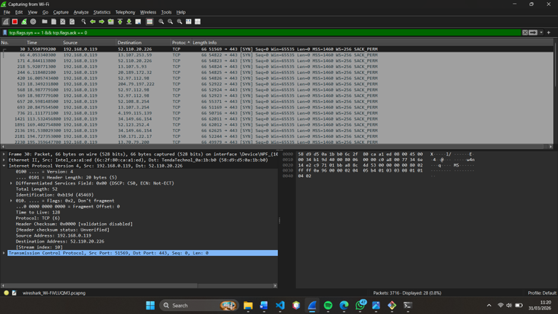
> *Gambar 16 : Paket TCP SYN dengan filter `tcp.flags.syn==1 && tcp.flags.ack==0`*
>
> 

**JAWAB:** Ya, alamat IP pada paket TCP SYN **sesuai** dengan alamat IP yang tertera pada pesan balasan DNS. Ini terjadi karena setelah browser menerima jawaban DNS yang berisi IP address dari `www.ietf.org`, browser langsung menggunakan IP tersebut untuk membuka koneksi TCP ke server. Paket TCP SYN dikirimkan ke IP yang **persis sama** dengan yang diberikan oleh DNS server. Hal ini membuktikan bahwa DNS berfungsi sebagai "penerjemah" yang hasil terjemahannya langsung digunakan untuk komunikasi jaringan selanjutnya.

---

### Pertanyaan 7 — DNS Query untuk Setiap Gambar

**Soal:** Halaman web yang sebelumnya anda akses (http://www.ietf.org) memuat beberapa gambar. Apakah host Anda perlu mengirimkan pesan permintaan DNS baru setiap kali ingin mengakses suatu gambar?


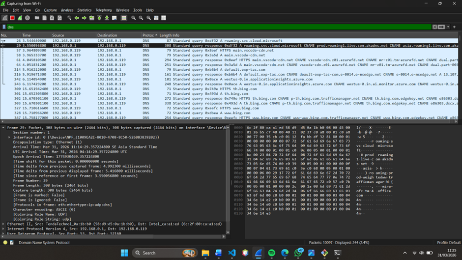
> *Gambar 17: Semua paket DNS dengan filter `dns` — tampilkan daftar lengkapnya*

**JAWAB:** **Tidak**. Host tidak perlu mengirimkan pesan permintaan DNS baru untuk setiap gambar, **selama gambar-gambar tersebut berasal dari domain yang sama** (www.ietf.org).

Penjelasannya adalah karena DNS memiliki mekanisme **caching**. Setelah browser mendapatkan IP dari `www.ietf.org` pada query pertama, hasil tersebut disimpan dalam DNS cache lokal. Untuk semua permintaan berikutnya (termasuk gambar) yang berasal dari domain yang sama, browser langsung menggunakan IP dari cache tanpa perlu mengirim DNS query baru.


# Konteks

Setelah melakukan capture Wireshark saat browsing `www.ietf.org`, modul meminta untuk melakukan tiga percobaan tambahan menggunakan **nslookup** sambil merekam paket di Wireshark. Pada setiap percobaan, fokus hanya pada **pasangan permintaan dan balasan terakhir** karena nslookup menghasilkan beberapa paket awal yang bersifat internal.

---

---

# Pnslookup www.mit.edu

# PERCOBAAN 1 — nslookup www.mit.edu

## Langkah yang Dilakukan

**Langkah 1 — Mulai Capture di Wireshark:**
1. Buka **Wireshark**
2. Pilih interface aktif (WiFi/Ethernet)
3. Klik tombol **Start Capture** (sirip hiu biru)

**Langkah 2 — Jalankan nslookup:**
1. Buka **Command Prompt**
2. Ketik perintah berikut lalu tekan Enter:
   ```
   nslookup www.mit.edu
   ```
3. Tunggu hingga hasil muncul sepenuhnya

**Langkah 3 — Stop dan Filter di Wireshark:**
1. Kembali ke Wireshark
2. Klik **Stop Capture** (kotak merah)
3. Di kolom filter, ketik: `dns` lalu tekan Enter
4. Perhatikan daftar paket — nslookup mengirim **3 query dan 3 response**
5. **Abaikan 2 pasang pertama** (PTR lookup otomatis oleh nslookup)
6. Fokus pada **pasangan query-response paling bawah** (untuk www.mit.edu)

>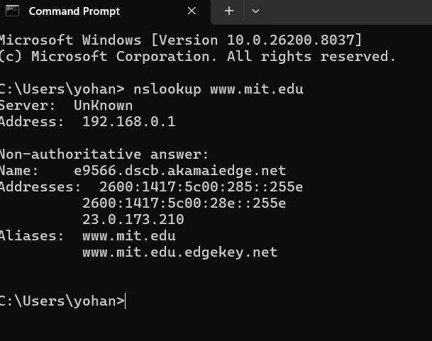
>
> *Tampilan Command Prompt setelah menjalankan `nslookup www.mit.edu`*


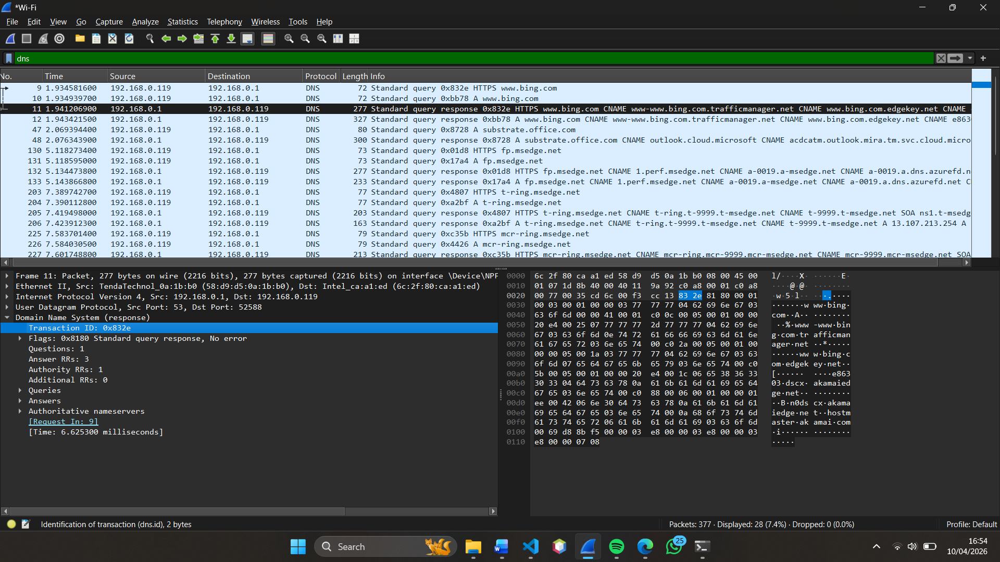
>
> *Tampilan Wireshark setelah filter `dns` — terlihat 6 paket DNS (3 query + 3 response)*

---

## Pertanyaan 1 — Port Tujuan dan Port Sumber

**Soal:** Apa port tujuan pada pesan permintaan DNS? Apa port sumber pada pesan balasan DNS?

**Langkah menjawab:**
1. Di Wireshark (filter `dns`), klik paket **DNS Query paling bawah** (pasangan terakhir)
2. Di panel detail (tengah), expand **"User Datagram Protocol"**
3. Catat nilai **Destination Port**
4. Klik paket **DNS Response paling bawah** (tepat di bawah query terakhir)
5. Expand **"User Datagram Protocol"**
6. Catat nilai **Source Port**

>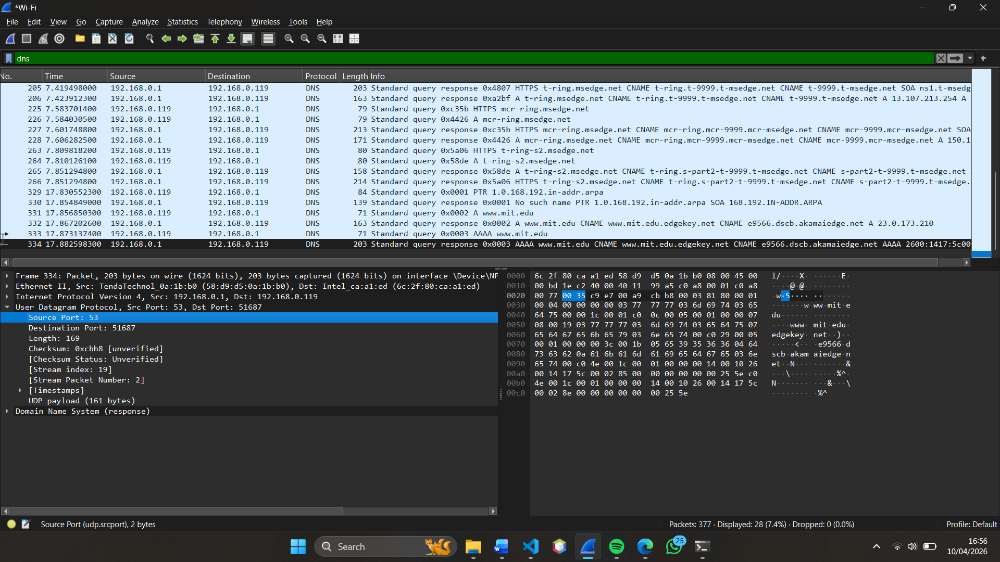
>
> *Detail "User Datagram Protocol" pada DNS Query terakhir — tampilkan Source Port dan Destination Port*

**JAWAB:**
- Port tujuan pada pesan **permintaan DNS: 53**
- Port sumber pada pesan **balasan DNS: 53**

Port 53 adalah port standar untuk layanan DNS. Setiap DNS query selalu dikirim ke port 53 milik server, dan setiap DNS response selalu berasal dari port 53.

---

## Pertanyaan 2 — Alamat IP Tujuan DNS Query

**Soal:** Ke alamat IP manakah pesan permintaan DNS dikirimkan? Apakah alamat IP tersebut merupakan default alamat IP server DNS lokal Anda?


>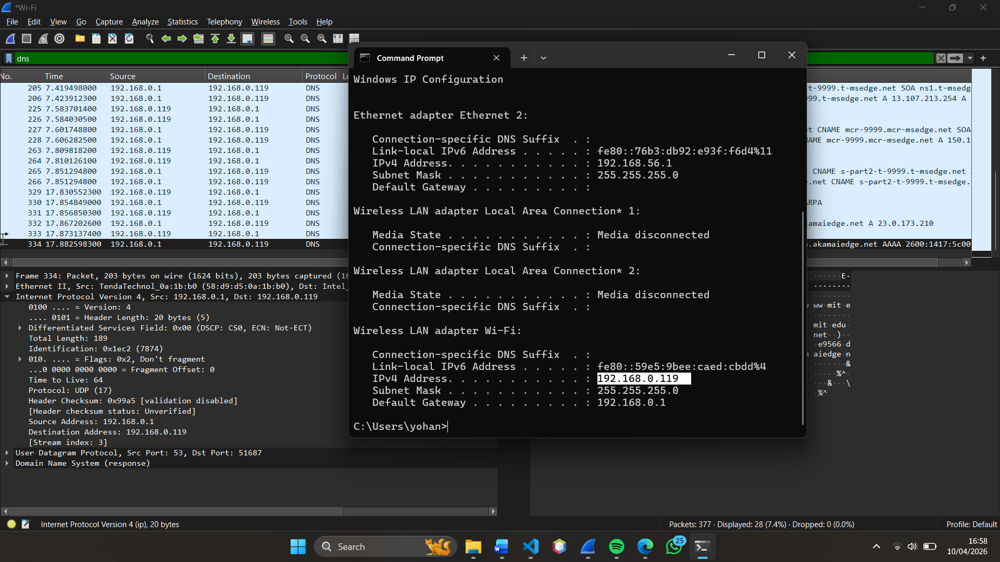
>
> *Detail "Internet Protocol Version 4" pada DNS Query — tampilkan Destination IP*
>
**JAWAB:**
Pesan permintaan DNS dikirimkan ke alamat IP **default DNS server lokal** komputer. Alamat IP tujuan pada paket DNS query di Wireshark **sama** dengan alamat DNS server yang ditampilkan oleh `ipconfig /all`. Ini terjadi karena nslookup (tanpa menentukan server tertentu) secara otomatis mengirim query ke DNS server default yang sudah dikonfigurasi di sistem.

---

## Pertanyaan 3 — Tipe Pesan dan Apakah Ada Jawaban

**Soal:** Periksa pesan permintaan DNS. Apa "jenis" atau "type" dari pesan tersebut? Apakah pesan tersebut mengandung "jawaban" atau "answers"?

>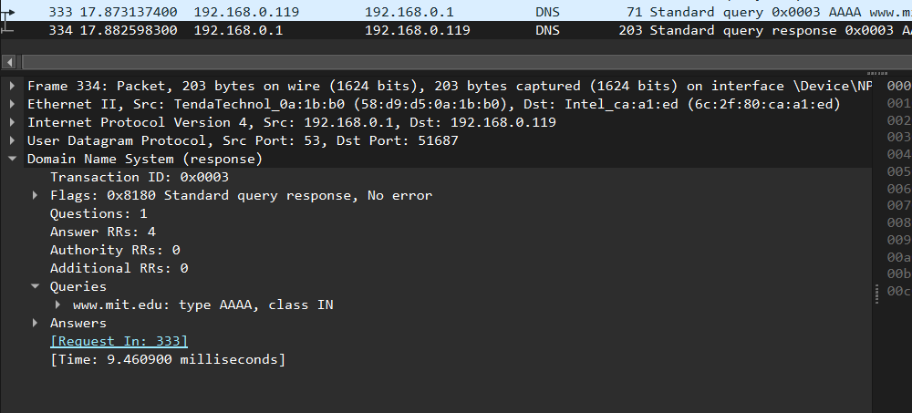
>
> *Detail "Domain Name System (query)" — expand Queries dan tampilkan field Type serta bagian Answers*


**JAWAB:**
- Tipe/jenis dari pesan permintaan DNS adalah **A (Host Address)** — artinya query meminta alamat IPv4 dari hostname www.mit.edu
- Pesan permintaan **TIDAK mengandung jawaban (Answers: 0)** — ini wajar karena permintaan hanya berisi pertanyaan, belum ada jawaban. Jawaban akan datang di paket response dari server

---

## Pertanyaan 4 — Isi Jawaban DNS Response

**Soal:** Periksa pesan balasan DNS. Berapa banyak "jawaban" atau "answers" yang terdapat di dalamnya. Apa saja isi yang terkandung dalam setiap jawaban tersebut?


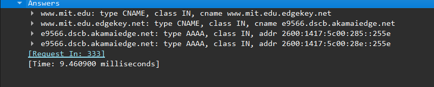
>
> *Detail "Domain Name System (response)" — expand Answers dan tampilkan seluruh isinya*

**JAWAB:**
DNS response untuk www.mit.edu mengandung **beberapa answers**. Setiap answer berisi:
- **Name:** www.mit.edu (nama domain yang ditanyakan)
- **Type:** A (IPv4 address) atau CNAME (alias)
- **TTL:** waktu dalam detik sebelum cache expire
- **Address:** alamat IP dari www.mit.edu (misal: 18.7.22.83)

Bisa terdapat lebih dari satu answer jika server memiliki beberapa IP (load balancing) atau menggunakan CNAME yang mengarah ke record lain.

---


# PERCOBAAN 2 — nslookup -type=NS mit.edu

**Langkah  — Jalankan nslookup:**
1. Di Command Prompt, ketik:
   ```
   nslookup -type=NS mit.edu
   ```
2. Tekan Enter dan tunggu hasil muncul


>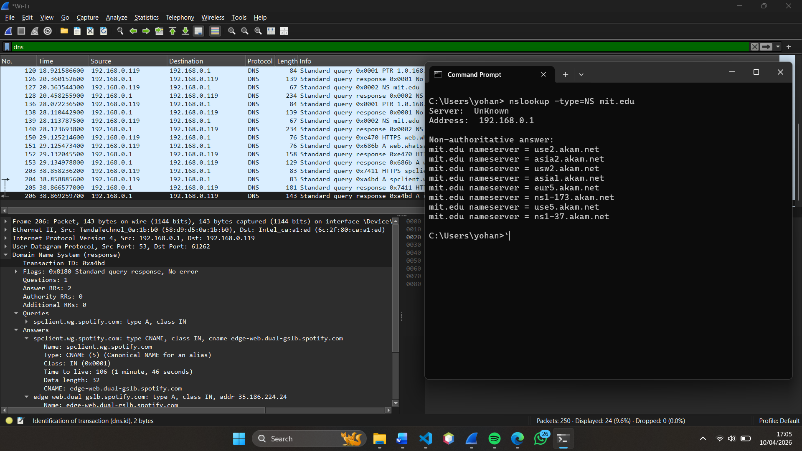
>
> *Tampilan Command Prompt setelah menjalankan `nslookup -type=NS mit.edu`*
>
> *Tampilan Wireshark filter `dns` — daftar paket DNS hasil percobaan ini*
>


## Pertanyaan 1 — Alamat IP Tujuan DNS Query

**Soal:** Ke alamat IP manakah pesan permintaan DNS dikirimkan? Apakah alamat IP tersebut merupakan default alamat IP server DNS lokal Anda?


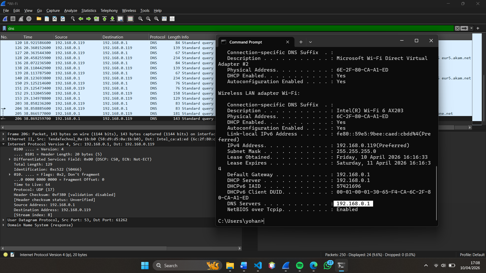
>
> *Internet Protocol Version 4 pada DNS Query — tampilkan Destination IP*

**JAWAB:**
Pesan permintaan DNS untuk `nslookup -type=NS mit.edu` dikirimkan ke alamat IP yang **sama** dengan default DNS server lokal (seperti yang terlihat di `ipconfig /all`). Meskipun query meminta record NS (bukan record A), namun tetap dikirim ke DNS resolver lokal yang sama karena tidak ada server DNS lain yang ditentukan secara eksplisit dalam perintah.

---

## Pertanyaan 2 — Tipe Pesan dan Apakah Ada Jawaban

**Soal:** Periksa pesan permintaan DNS. Apa "jenis" atau "type" dari pesan tersebut? Apakah pesan tersebut mengandung "jawaban" atau "answers"?

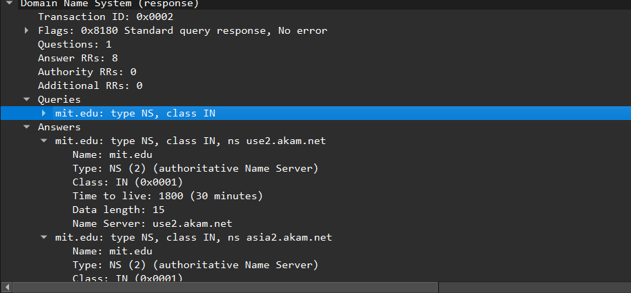
>
> *Detail DNS Query — expand Queries dan tampilkan field Type serta Answers*

**JAWAB:**
- Tipe/jenis dari pesan permintaan DNS adalah **NS (Name Server)** — sesuai dengan opsi `-type=NS` yang digunakan, artinya query meminta informasi name server (DNS server otoritatif) untuk domain mit.edu
- Pesan permintaan **TIDAK mengandung jawaban (Answers: 0)** — sama seperti sebelumnya, permintaan hanya berisi query tanpa jawaban

---

## Pertanyaan 3 — Nama Server MIT dan Alamat IP-nya

**Soal:** Periksa pesan balasan DNS. Apa nama server MIT yang diberikan oleh pesan balasan? Apakah pesan balasan ini juga memberikan alamat IP untuk server MIT tersebut?


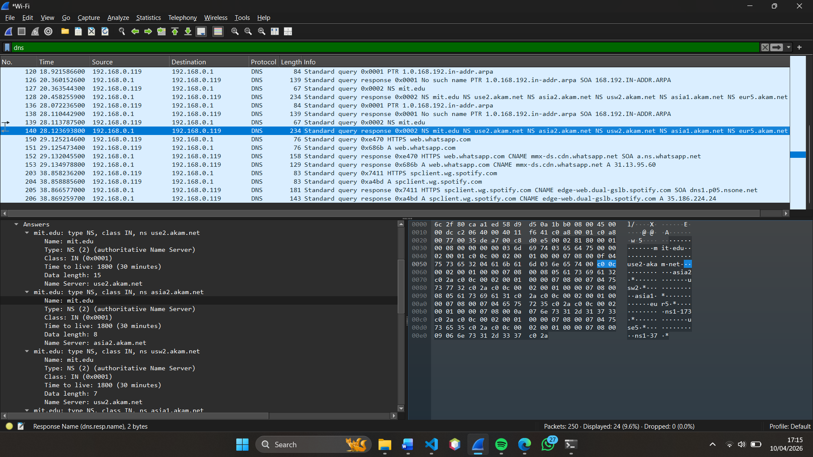
>
> *Detail DNS Response — expand Answers*
>
## Sekarang, ulangi percobaan sebelumnya, namun gunakan perintah:   
**nslookup www.aiit.or.kr bitsy.mit.edu**

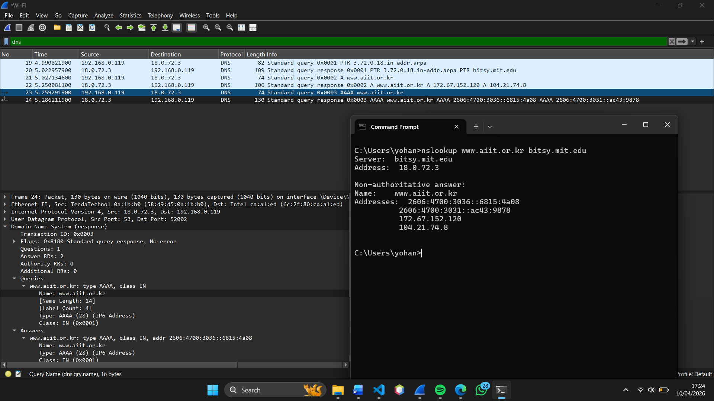

## Pertanyaan 1 — Alamat IP Tujuan DNS Query

**Soal:** Ke alamat IP manakah pesan permintaan DNS dikirimkan? Apakah alamat IP tersebut merupakan default alamat IP server DNS lokal Anda?

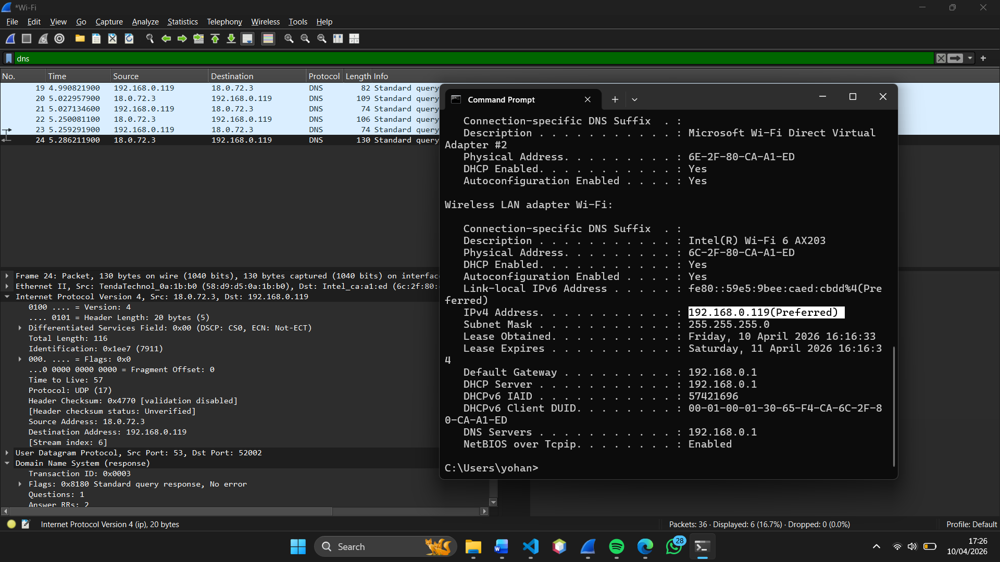
>
> *Internet Protocol Version 4 pada DNS Query — tampilkan Destination IP*
>

## Pertanyaan 2 — Tipe Pesan dan Apakah Ada Jawaban

**Soal:** Periksa pesan permintaan DNS. Apa "jenis" atau "type" dari pesan tersebut? Apakah pesan tersebut mengandung "jawaban" atau "answers"?


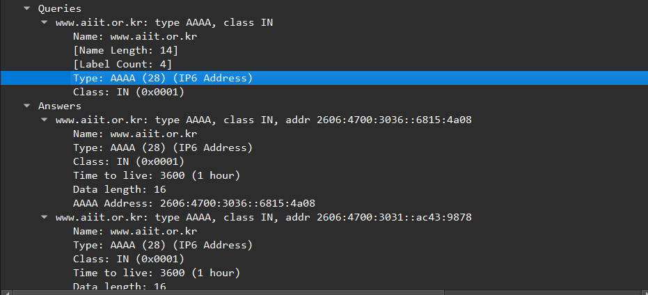
>
> *Detail DNS Query — expand Queries dan tampilkan field Type*
>
**JAWAB:**
- Tipe/jenis dari pesan permintaan DNS adalah **A (Host Address)** — query meminta alamat IPv4 dari `www.aiit.or.kr`


---

## Pertanyaan 3 — Jumlah dan Isi Jawaban DNS Response

**Soal:** Periksa pesan balasan DNS. Berapa banyak "jawaban" atau "answers" yang terdapat di dalamnya. Apa saja isi yang terkandung dalam setiap jawaban tersebut?

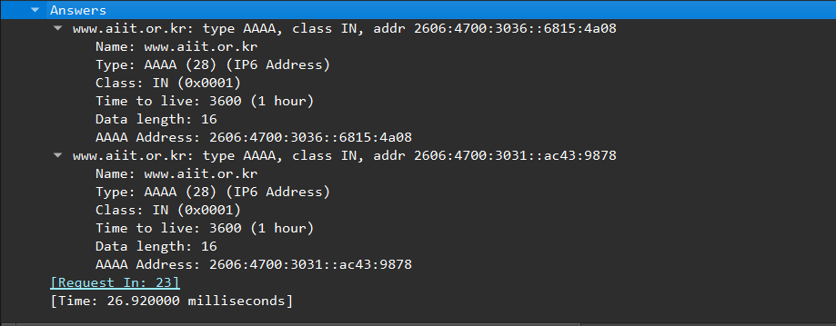
>
> *Detail DNS Response — expand Answers dan tampilkan seluruh isinya*

