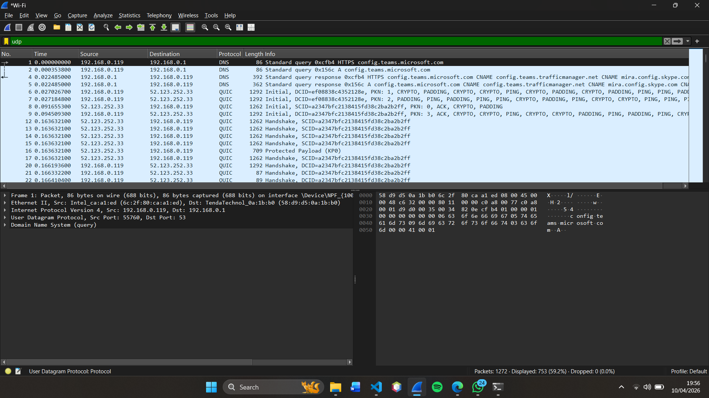
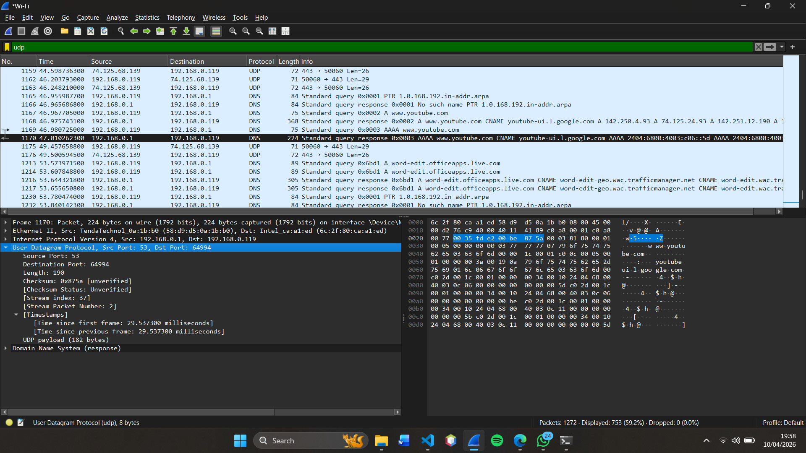
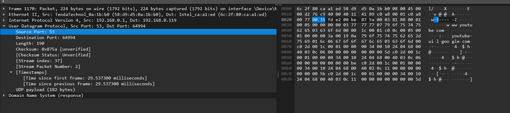

# Laporan Praktikum Jaringan Komputer - Modul 5


### Identitas Praktikan

| Item | Keterangan |
|------|------------|
| **Nama** | YOHANNA PURNOMO |
| **NIM** | 103072400127 |
| **Kelas** | IF-04-01 |

---

# MODUL 5 — UDP

# 1. Tujuan Praktikum

Berdasarkan modul praktikum Jaringan Komputer, tujuan dari Modul 5 adalah:

1. Memahami cara kerja **protokol transport UDP (User Datagram Protocol)**.
2. Menggunakan **Wireshark** untuk menangkap dan menganalisis paket UDP.
3. Memahami struktur **header UDP** beserta ukuran dan fungsi masing-masing field.
4. Memahami hubungan **nomor port** antara paket request dan response UDP.

---

# 2. Dasar Teori

User Datagram Protocol (UDP) adalah salah satu protokol transport yang berjalan di atas lapisan IP. UDP bersifat **connectionless** (tidak memerlukan koneksi terlebih dahulu) dan **unreliable** (tidak menjamin pengiriman data), berbeda dengan TCP yang bersifat connection-oriented dan reliable.

Meskipun demikian, UDP lebih ringan dan cepat karena:
- Tidak ada proses handshake sebelum pengiriman
- Tidak ada mekanisme acknowledgment
- Header UDP hanya berukuran **8 byte** (sangat kecil)

UDP biasa digunakan untuk aplikasi yang memprioritaskan **kecepatan** daripada keandalan, seperti streaming video, VoIP, game online, dan DNS.

Header UDP terdiri dari 4 field dengan masing-masing 2 byte:

| Field | Ukuran | Fungsi |
|-------|--------|--------|
| Source Port | 2 byte | Nomor port pengirim |
| Destination Port | 2 byte | Nomor port penerima |
| Length | 2 byte | Total panjang header + data |
| Checksum | 2 byte | Verifikasi integritas data |

---

# 3. Langkah Praktikum

Langkah-langkah umum yang dilakukan pada praktikum Modul 5:

1. Membuka **Wireshark** dan memilih interface jaringan aktif.
2. Memulai proses **capture paket**.
3. Membuka **Command Prompt** dan menjalankan perintah `nslookup` untuk menghasilkan paket UDP.
4. Menghentikan capture dan menggunakan filter `udp` di Wireshark.
5. Memilih satu paket UDP dan menganalisis header-nya secara detail.

---

# 4. Hasil dan Pembahasan

## 4.1 Persiapan — Menghasilkan Paket UDP

**Langkah yang dilakukan:**

1. Buka **Wireshark** → pilih interface aktif (WiFi atau Ethernet)
2. Klik tombol **Start Capture** (sirip hiu biru)
3. Buka **Command Prompt** → ketik perintah berikut untuk menghasilkan paket UDP (DNS query):
   ```
   nslookup www.google.com
   nslookup www.youtube.com
   nslookup www.github.com
   ```
4. Kembali ke Wireshark → klik **Stop Capture**
5. Di kolom filter, ketik: `udp` lalu tekan Enter
6. Pilih salah satu paket UDP untuk dianalisis


> *Screenshot: Tampilan Wireshark setelah filter `udp` — daftar paket UDP yang tertangkap*

> **[TEMPAT SCREENSHOT B]**
> *Screenshot: Paket UDP yang dipilih dengan detail header UDP di-expand di panel tengah*


---

## 4.2 Pertanyaan dan Jawaban

---

### Pertanyaan 1 — Jumlah Field Header UDP

**Soal:** Pilih satu paket UDP yang terdapat pada trace Anda. Dari paket tersebut, berapa banyak "field" yang terdapat pada header UDP? Sebutkan nama-nama field yang Anda temukan!


>
> *Screenshot: Detail paket UDP — expand "User Datagram Protocol" dan tampilkan semua field*

**JAWAB:** Header UDP terdiri dari **4 field**, yaitu:

| No | Nama Field | Nilai (Contoh) |
|----|-----------|---------------|
| 1 | **Source Port** | Port pengirim (acak) |
| 2 | **Destination Port** | 53 (untuk DNS) |
| 3 | **Length** | Total panjang header + data |
| 4 | **Checksum** | Nilai checksum |

Keempat field tersebut terlihat jelas saat bagian "User Datagram Protocol" di-expand pada panel detail Wireshark.

---

### Pertanyaan 2 — Panjang Masing-Masing Field Header UDP

**Soal:** Perhatikan informasi "content field" pada paket yang Anda pilih di pertanyaan 1. Berapa panjang (dalam satuan byte) masing-masing "field" yang terdapat pada header UDP?


> *Screenshot: Klik field "Source Port" di panel detail — lihat highlight di panel hex bawah (2 byte ter-highlight)*


**JAWAB:**

| Field | Panjang |
|-------|---------|
| Source Port | **2 byte (16 bit)** |
| Destination Port | **2 byte (16 bit)** |
| Length | **2 byte (16 bit)** |
| Checksum | **2 byte (16 bit)** |
| **Total Header UDP** | **8 byte (64 bit)** |

Ketika setiap field diklik di panel detail Wireshark, panel hex di bagian bawah akan meng-highlight tepat **2 byte** yang merepresentasikan field tersebut, membuktikan bahwa setiap field berukuran 2 byte.

---


## Pertanyaan 3 — Arti Field Length

**Jawaban:**

Field **Length** pada UDP menyatakan **total ukuran datagram UDP**, yaitu gabungan antara header dan payload (data).

**Rumus:**

```
Length = 8 byte (header) + payload
```

**Verifikasi dari hasil Wireshark:**

* Length = 190 byte
* Header = 8 byte
* Payload = 182 byte

Sehingga:

```
190 = 8 + 182 
```

Hal ini menunjukkan bahwa nilai Length mencakup seluruh bagian UDP (header + data), bukan hanya data saja.

---

## Pertanyaan 4 — Ukuran Maksimum Payload UDP

**Jawaban:**

Ukuran maksimum payload UDP adalah **65.507 byte**.

**Perhitungan:**

* Maksimum ukuran datagram IP = 65.535 byte
* Header IP = 20 byte
* Header UDP = 8 byte

Sehingga:

```
65.535 - 20 - 8 = 65.507 byte
```

---

## Pertanyaan 5 — Nomor Port Terbesar

**Jawaban:**

Nomor port terbesar yang dapat digunakan adalah **65.535**.

**Penjelasan:**

* Field port berukuran 16 bit
* Maksimum nilai = 2^16 - 1 = 65.535

---

## Pertanyaan 6 — Nomor Protokol UDP

**Jawaban:**

Nomor protokol UDP adalah:

* Desimal: **17**
* Heksadesimal: **0x11**

Pada Wireshark terlihat pada bagian:

```
Protocol: UDP (17)
```

---

## Pertanyaan 7 — Hubungan Port Request dan Response

**Jawaban:**

Berdasarkan hasil capture Wireshark:

|                  | DNS Query (Request) | DNS Response |
| ---------------- | ------------------- | ------------ |
| Source Port      | 64994               | 53           |
| Destination Port | 53                  | 64994        |

**Penjelasan:**

* Saat client mengirim request:

  * Source Port = 64994 (port acak)
  * Destination Port = 53 (DNS server)

* Saat server membalas:

  * Source Port = 53
  * Destination Port = 64994

**Kesimpulan:**
Port pada paket UDP request dan response **saling bertukar (swap)**.

---

## Analisis Tambahan

Berdasarkan screenshot Wireshark:

* IP Server: 192.168.0.1
* IP Client: 192.168.0.119
* Protokol: UDP
* Port: 53 (DNS)

Hal ini menunjukkan bahwa komunikasi DNS menggunakan:

* Protokol UDP
* Port 53
* DNS server lokal (router)

---


# 5. Analisis Singkat


## Modul 5 — UDP

Dari hasil praktikum Modul 5 menggunakan Wireshark dapat diketahui bahwa:

- Header UDP hanya terdiri dari **4 field** dengan total ukuran tetap **8 byte**.
- Setiap field berukuran **2 byte (16 bit)**.
- Field **"Length"** menunjukkan total ukuran datagram (header + payload), bukan hanya payload saja.
- Nomor port berkisar dari **0 hingga 65,535**.
- Nomor protokol UDP dalam header IP adalah **17 (0x11)**.
- Pada pasangan request-response UDP, **nomor port saling bertukar** antara pengirim dan penerima.

