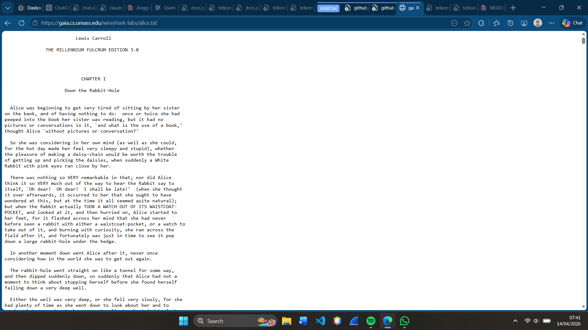
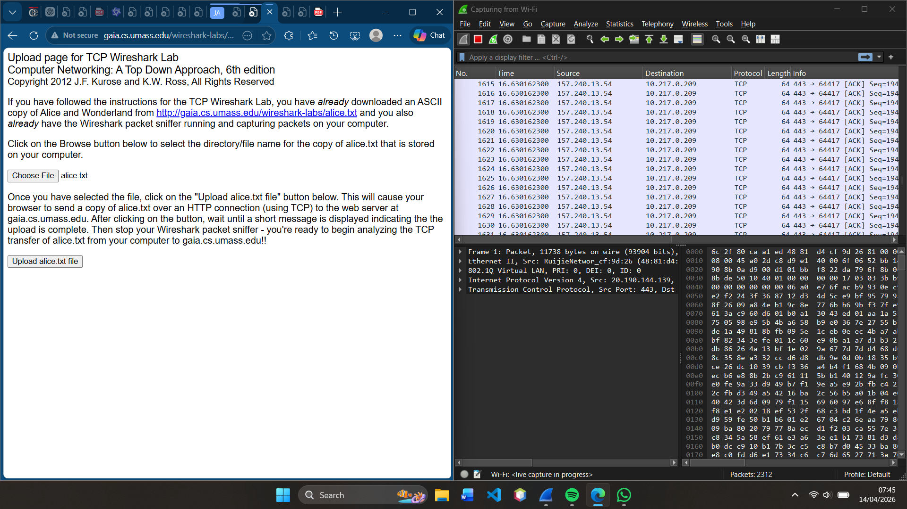
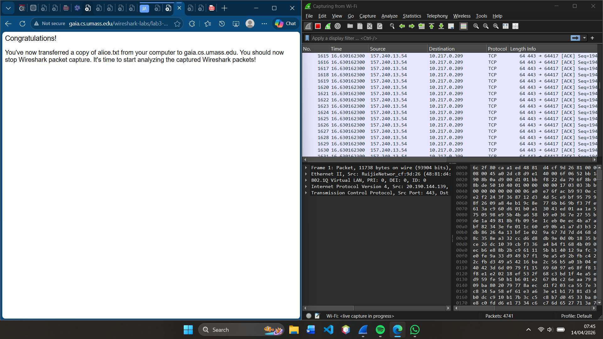
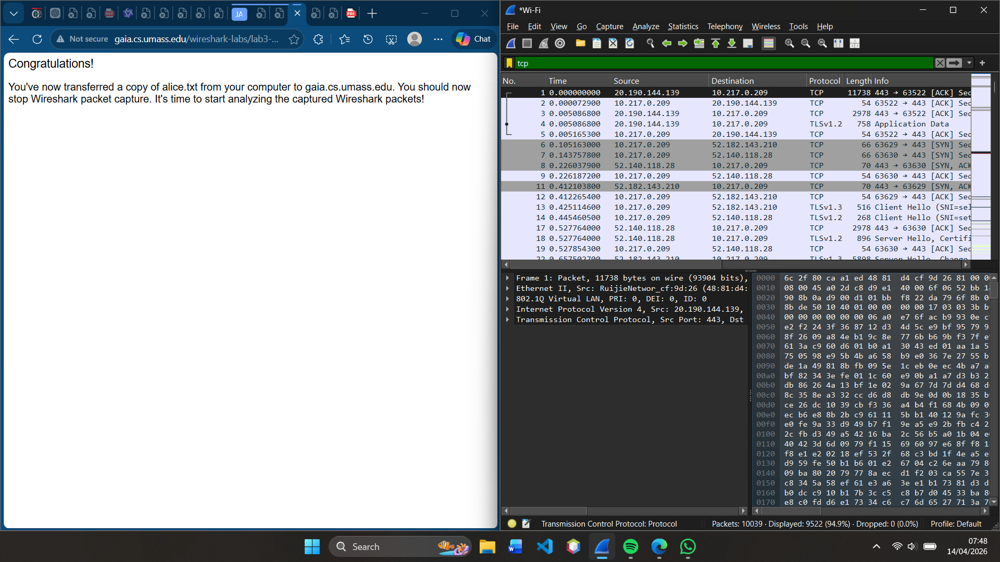
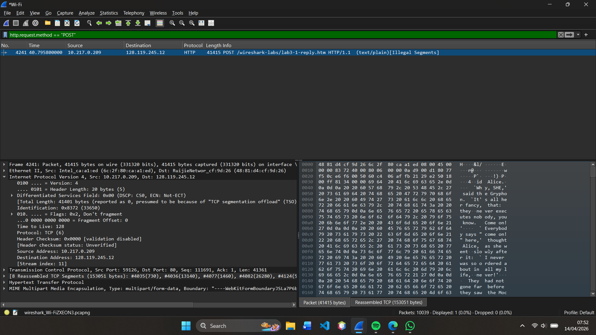

# Laporan Praktikum Jaringan Komputer - Modul 6

### Identitas Praktikan

| Item | Keterangan |
|------|------------|
| **Nama** | YOHANNA PURNOMO |
| **NIM** | 103072400127 |
| **Kelas** | IF-04-01 |

---

# MODUL 6 — TCP

# 1. Tujuan Praktikum

Berdasarkan modul praktikum Jaringan Komputer, tujuan dari Modul 6 adalah:

1. Memahami cara kerja **protokol TCP (Transmission Control Protocol)**  
2. Menganalisis proses **Three-Way Handshake**  
3. Memahami **Sequence Number dan Acknowledgement**  
4. Mengamati proses transfer data menggunakan **HTTP POST**  
5. Menganalisis segmentasi data dalam TCP  

---

# 2. Dasar Teori

TCP (Transmission Control Protocol) adalah protokol transport yang bersifat **connection-oriented** dan **reliable**.

TCP memastikan data:
- Dikirim secara berurutan  
- Tidak hilang  
- Tidak duplikat  

Fitur utama TCP:
- **Three-Way Handshake** (membuka koneksi)  
- **Sequence Number** (nomor urut data)  
- **Acknowledgement** (konfirmasi penerimaan)  
- **Flow Control**  
- **Congestion Control**  

---

# 3. Langkah Praktikum

1. Download file `alice.txt`
2. Membuka halaman upload file
3. Menjalankan Wireshark dan capture paket
4. Upload file menggunakan HTTP POST
5. Menghentikan capture
6. Filter paket dengan `tcp`

---

# 4. Hasil dan Pembahasan

## 4.1 Persiapan — Capture TCP

**Langkah yang dilakukan:**

1. Buka browser dan download file: http://gaia.cs.umass.edu/wireshark-labs/alice.txt
2. Buka halaman: http://gaia.cs.umass.edu/wireshark-labs/TCP-wireshark-file1.html
3. Jalankan Wireshark → Start Capture  
4. Upload file `alice.txt`  
5. Stop capture  
6. Gunakan filter: `tcp`  

> *Screenshot: Halaman file*

*Screenshot: proses up file*

*Screenshot: up file file*

> *Screenshot: Hasil capture setelah filter `tcp`*

## 4.2 HTTP POST

> *Screenshot: Paket yang berisi HTTP POST*

**Penjelasan:**
- Digunakan untuk mengirim file ke server  
- Data dikirim melalui beberapa segmen TCP  

---

## 4.2 Pertanyaan dan Jawaban

---

### Pertanyaan 1 — IP Address dan Port Client

**JAWAB:**

IP Address client adalah alamat IP dari perangkat yang digunakan untuk melakukan upload file.  
Biasanya berupa IP lokal, misalnya **192.168.x.x**.

Port client menggunakan **ephemeral port (port acak)** dengan range **1024 – 65535**, misalnya **49152**.  
Port ini digunakan sementara untuk komunikasi dengan server.

---

### Pertanyaan 2 — IP Address dan Port Server

**JAWAB:**

IP Address server pada praktikum ini adalah:

- **128.119.245.12 (gaia.cs.umass.edu)**  

Port yang digunakan server adalah:

- **Port 80 (HTTP)**  

Port 80 digunakan karena komunikasi dilakukan menggunakan protokol HTTP.

---

### Pertanyaan 3 — Three-Way Handshake

**JAWAB:**

Three-Way Handshake adalah proses pembentukan koneksi TCP yang terdiri dari:

1. **SYN** → Client mengirim permintaan koneksi ke server  
2. **SYN-ACK** → Server merespon permintaan client  
3. **ACK** → Client mengkonfirmasi koneksi  

Setelah proses ini selesai, koneksi TCP berhasil terbentuk dan data dapat dikirim.

---

### Pertanyaan 4 — Sequence Number pada SYN

**JAWAB:**

Sequence Number pada paket SYN adalah **nomor awal (initial sequence number)** yang digunakan untuk memulai komunikasi.

Nilainya biasanya **acak (random)** untuk keamanan.  
Dalam Wireshark biasanya ditampilkan sebagai **relative sequence number (dimulai dari 0)**.

---

### Pertanyaan 5 — SYN-ACK dan Acknowledgement

**JAWAB:**

Pada paket SYN-ACK:

- Server mengirim **Sequence Number miliknya sendiri**
- Server juga mengirim **Acknowledgement Number = Sequence Number client + 1**

Hal ini menunjukkan bahwa server telah menerima paket SYN dari client.

---

### Pertanyaan 6 — HTTP POST

**JAWAB:**

HTTP POST digunakan untuk mengirim file dari client ke server.

Pada praktikum ini:
- File `alice.txt` dikirim menggunakan metode POST
- Data dikirim melalui beberapa segmen TCP

POST berada pada bagian **payload (data)** dari TCP.

---

### Pertanyaan 7 — Sequence Number pada Segmen Awal

**JAWAB:**

Sequence Number pada setiap segmen TCP akan **bertambah sesuai jumlah byte data yang dikirim**.

Artinya:
- Setiap segmen memiliki nomor urut berbeda
- Kenaikan sequence number tergantung ukuran data

Hal ini digunakan agar data dapat disusun kembali dengan urut di sisi penerima.

---

### Pertanyaan 8 — RTT (Round Trip Time)

**JAWAB:**

RTT (Round Trip Time) adalah waktu yang dibutuhkan untuk:

- Mengirim segmen dari client ke server  
- Menerima ACK dari server  

Rumus:
RTT = waktu ACK - waktu kirim  

RTT digunakan untuk mengukur performa jaringan.

---

### Pertanyaan 9 — Segmentasi TCP

**JAWAB:**

Karena ukuran file besar, TCP akan memecah data menjadi beberapa segmen kecil.

Ciri segmentasi:
- Banyak paket TCP dikirim  
- Ditandai dengan “TCP segment of a reassembled PDU” di Wireshark  

Tujuannya:
- Mempermudah pengiriman  
- Menghindari error  
- Menyesuaikan kapasitas jaringan  

---