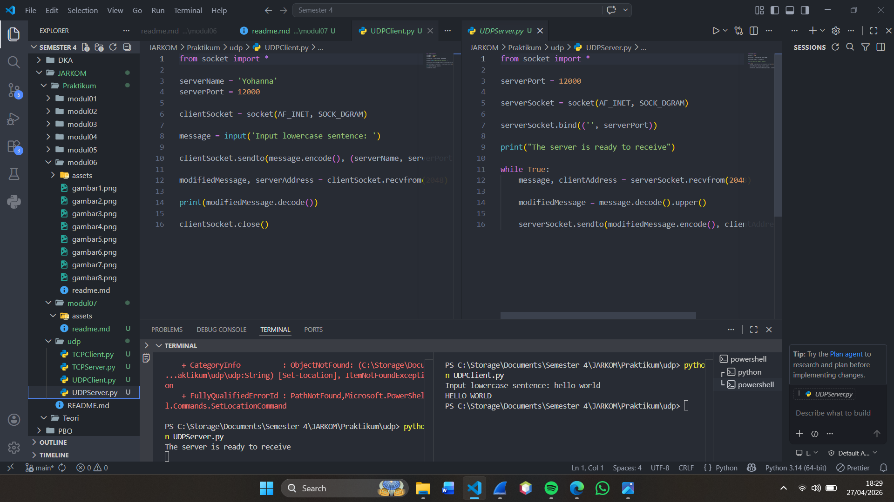
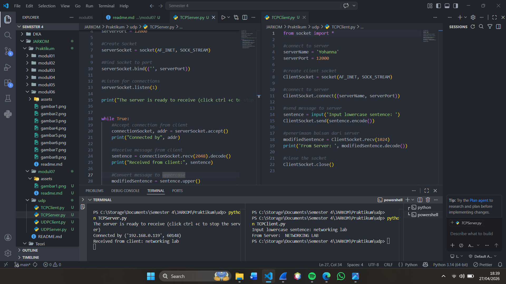

# Laporan Praktikum Jaringan Komputer - Modul 7
## Socket Programming: UDP dan TCP

### Identitas Praktikan
| Item | Keterangan |
|------|------------|
| **Nama** | YOHANNA PURNOMO |
| **NIM** | 103072400127 |
| **Kelas** | IF-04-01 |


---

## 7.1 Tujuan Praktikum
1. Membuat aplikasi client-server menggunakan UDP socket
2. Membuat aplikasi client-server menggunakan TCP socket
3. Memahami perbedaan implementasi UDP dan TCP
4. Menganalisis pertukaran data antara client dan server

---

## 7.2 Praktikum UDP Socket

### 7.2.1 Kode Program UDP Server

**File:** `UDPServer.py`

```python
from socket import *

serverPort = 12000
serverSocket = socket(AF_INET, SOCK_DGRAM)
serverSocket.bind(('', serverPort))

print("The server is ready to receive")

while True:
    message, clientAddress = serverSocket.recvfrom(2048)
    modifiedMessage = message.decode().upper()
    serverSocket.sendto(modifiedMessage.encode(), clientAddress)
```

**Penjelasan:**
- Server membuat socket UDP dengan `SOCK_DGRAM`
- Bind ke port 12000 agar bisa menerima koneksi pada port tersebut
- Looping terus menerus (`while True`) untuk menerima pesan dari client
- Pesan yang diterima diubah menjadi uppercase lalu dikirim balik ke client

---

### 7.2.2 Kode Program UDP Client

**File:** `UDPClient.py`

```python
from socket import *

serverName = 'localhost'
serverPort = 12000

clientSocket = socket(AF_INET, SOCK_DGRAM)
message = input('Input lowercase sentence: ')
clientSocket.sendto(message.encode(), (serverName, serverPort))

modifiedMessage, serverAddress = clientSocket.recvfrom(2048)
print(modifiedMessage.decode())

clientSocket.close()
```

**Penjelasan:**
- Client membuat socket UDP dengan tipe `SOCK_DGRAM` (tidak perlu bind port)
- Langsung kirim pesan ke server menggunakan `sendto()` beserta alamat tujuan
- Terima response dari server dengan `recvfrom()`
- Tidak perlu `connect()` karena UDP bersifat connectionless
- Socket ditutup setelah selesai dengan `close()`

---

### 7.2.3 Hasil Eksekusi UDP

#### Langkah-langkah Testing:

**Step 1 — Jalankan UDP Server**

Buka terminal pertama, lalu jalankan server:
```
python UDPServer.py
```
---

**Step 2 — Jalankan UDP Client dan Kirim Pesan**

Buka terminal kedua, jalankan client dan input kalimat huruf kecil:
```
python UDPClient.py
```



> *Screenshot menampilkan: output `"The server is ready to receive"` di terminal, menandakan server sudah aktif dan siap menerima pesan dari client dan prompt `"Input lowercase sentence:"`, lalu kamu ketik kalimat (contoh: `hello world`), kemudian output yang muncul dari server berupa huruf kapital (`HELLO WORLD`)*

---

**Hasil:**
- Input dari client: `hello world`
- Output dari server: `HELLO WORLD`
- Pesan berhasil dikonversi ke uppercase oleh server dan dikirim kembali ke client

---

## 7.3 Praktikum TCP Socket

### 7.3.1 Kode Program TCP Server

**File:** `TCPServer.py`

```python
from socket import *

serverPort = 12000
serverSocket = socket(AF_INET, SOCK_STREAM)
serverSocket.bind(('', serverPort))
serverSocket.listen(1)

print('The server is ready to receive')

while True:
    connectionSocket, addr = serverSocket.accept()
    sentence = connectionSocket.recv(1024).decode()
    capitalizedSentence = sentence.upper()
    connectionSocket.send(capitalizedSentence.encode())
    connectionSocket.close()
```

**Penjelasan:**
- Server membuat socket TCP dengan tipe `SOCK_STREAM`
- `listen(1)` → server siap menerima koneksi masuk (maksimal 1 antrian)
- `accept()` → menerima koneksi dari client dan membuat `connectionSocket` baru khusus client tersebut
- Setelah selesai, `connectionSocket.close()` ditutup, namun `serverSocket` tetap berjalan menunggu client baru

---

### 7.3.2 Kode Program TCP Client

**File:** `TCPClient.py`

```python
from socket import *

serverName = 'localhost'
serverPort = 12000

clientSocket = socket(AF_INET, SOCK_STREAM)
clientSocket.connect((serverName, serverPort))

sentence = input('Input lowercase sentence: ')
clientSocket.send(sentence.encode())

modifiedSentence = clientSocket.recv(1024)
print('From Server:', modifiedSentence.decode())

clientSocket.close()
```

**Penjelasan:**
- Client membuat socket TCP dengan tipe `SOCK_STREAM`
- `connect()` → melakukan inisiasi koneksi ke server (proses 3-way handshake terjadi di sini)
- Kirim data menggunakan `send()` tanpa perlu menyertakan alamat tujuan (sudah terhubung)
- Terima response dari server dengan `recv()`
- Koneksi ditutup dengan `close()` setelah selesai

---

### 7.3.3 Hasil Eksekusi TCP

#### Langkah-langkah Testing:

**Step 1 — Jalankan TCP Server**

Buka terminal pertama, lalu jalankan server:
```
python TCPServer.py
```

---

**Step 2 — Jalankan TCP Client dan Kirim Pesan**

Buka terminal kedua, jalankan client dan input kalimat:
```
python TCPClient.py
```


> *Screenshot menampilkan: output `"The server is ready to receive"` di terminal, menandakan server TCP sudah aktif, melakukan `listen()`, dan menunggu koneksi dari client dan prompt `"Input lowercase sentence:"`, lalu kamu ketik kalimat (contoh: `networking lab`), kemudian muncul output `"From Server: NETWORKING LAB"` sebagai balasan dari server*

---

**Hasil:**
- Input dari client: `networking lab`
- Output dari server: `NETWORKING LAB`
- Koneksi TCP berhasil established sebelum data dikirim (3-way handshake)

---

## 7.4 Perbandingan UDP vs TCP (Hasil Praktikum)

### 7.4.1 Perbedaan Implementasi

| Aspek | UDP | TCP |
|-------|-----|-----|
| **Socket Type** | `SOCK_DGRAM` | `SOCK_STREAM` |
| **Koneksi** | Tidak perlu `connect()` | Perlu `connect()` |
| **Server Socket** | 1 socket untuk semua client | 2 socket (serverSocket + connectionSocket) |
| **Send/Receive** | `sendto()` / `recvfrom()` | `send()` / `recv()` |
| **Alamat Tujuan** | Harus di-specify setiap kirim | Otomatis (sudah ada koneksi) |

---

### 7.4.2 Perbedaan Karakteristik

| Karakteristik | UDP | TCP |
|--------------|-----|-----|
| **Kecepatan** | Lebih cepat (langsung kirim) | Ada delay karena handshake |
| **Multi Client** | Server handle banyak client sekaligus | Handle 1 client per waktu (sequential) |
| **Reliability** | Tidak ada jaminan delivery | Data terjamin sampai & berurutan |
| **Overhead** | Ringan, header kecil | Lebih besar karena ada kontrol koneksi |

---

## 7.5 Analisis Praktikum

### 7.5.1 Analisis UDP Socket

**Hasil Pengamatan:**
- Server dapat menerima pesan dari berbagai client tanpa membuat koneksi terlebih dahulu
- Tidak ada proses koneksi yang terlihat, pesan langsung dikirim dan diterima
- Tidak ada konfirmasi bahwa pesan sudah sampai ke tujuan (best-effort delivery)

**Keunggulan UDP:**
- Implementasi lebih sederhana dan tidak ada overhead koneksi
- Cocok untuk aplikasi real-time seperti video streaming, VoIP, dan gaming

**Keterbatasan UDP:**
- Tidak ada jaminan pesan sampai ke tujuan
- Tidak ada pengurutan data (data bisa tiba tidak berurutan)
- Tidak ada mekanisme retransmisi jika paket hilang

---

### 7.5.2 Analisis TCP Socket

**Hasil Pengamatan:**
- Proses `connect()` dilakukan sebelum data bisa dikirim (3-way handshake)
- Server membuat socket baru (`connectionSocket`) untuk setiap client yang terhubung
- Data terjamin sampai dalam urutan yang benar
- Koneksi ditutup secara eksplisit setelah komunikasi selesai

**Keunggulan TCP:**
- Reliable delivery — data terjamin sampai
- Data terurut sesuai urutan pengiriman
- Memiliki mekanisme flow control dan congestion control

**Keterbatasan TCP:**
- Overhead lebih besar dibanding UDP
- Ada delay akibat proses 3-way handshake
- Lebih kompleks dalam implementasinya

---

## 7.6 Testing Tambahan

### 7.6.1 Multiple Clients pada UDP

**Percobaan:** Jalankan beberapa client UDP secara bersamaan

**Hasil:**
- UDP server dapat menangani multiple client sekaligus
- Semua client menggunakan satu socket yang sama di server
- Pesan dari tiap client diproses satu per satu di dalam loop

---

### 7.6.2 Multiple Clients pada TCP

**Percobaan:** Coba hubungkan beberapa client TCP ke server yang sama

**Hasil:**
- TCP server menangani client secara sequential (satu per satu)
- Client kedua harus menunggu client pertama selesai diproses
- Setiap client yang berhasil terhubung mendapat `connectionSocket` yang terpisah

> **Catatan:** Untuk menangani multiple client secara bersamaan (concurrent) pada TCP, diperlukan implementasi **threading** — setiap client dijalankan di thread terpisah.

---

## 7.7 Kesimpulan

Berdasarkan praktikum yang telah dilakukan:

1. **UDP Socket:**
   - Bersifat connectionless, tidak memerlukan proses handshake
   - Implementasi lebih sederhana dengan `sendto()` dan `recvfrom()`
   - Cocok untuk aplikasi yang mengutamakan kecepatan (DNS, streaming, VoIP, gaming)
   - Tidak ada jaminan delivery maupun pengurutan data

2. **TCP Socket:**
   - Bersifat connection-oriented, memerlukan 3-way handshake sebelum transfer data
   - Menggunakan `send()` / `recv()` dan membutuhkan `connect()`, `listen()`, `accept()`
   - Data terjamin sampai dan berurutan
   - Cocok untuk aplikasi yang membutuhkan keandalan (Web, email, file transfer)

3. **Perbedaan Utama:**
   - UDP: 1 socket server, pakai `sendto()`/`recvfrom()`, alamat tujuan disertakan tiap kirim
   - TCP: 2 socket server (welcoming + connection socket), pakai `send()`/`recv()`

4. **Socket programming** memberikan kontrol penuh terhadap komunikasi jaringan di application layer dan menjadi dasar dari berbagai protokol jaringan yang kita gunakan sehari-hari.

---
