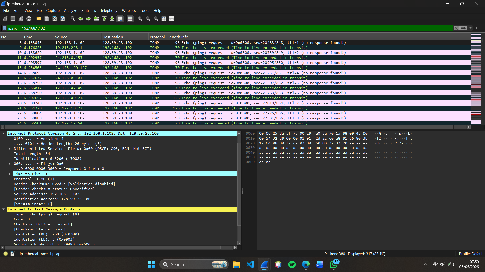
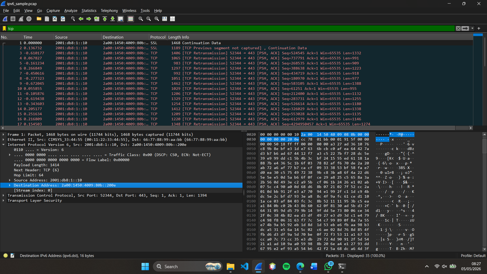

# Laporan Praktikum Jaringan Komputer - Modul 10

## IP

---

## Identitas Praktikan

| Item      | Keterangan      |
| --------- | --------------- |
| **Nama**  | YOHANNA PURNOMO |
| **NIM**   | 103072400127    |
| **Kelas** | IF-04-01        |

---

## 10.1 Tujuan Praktikum

1. Memahami konsep dasar IPv4
2. Menggunakan perintah ICMP (ping) untuk testing jaringan
3. Memahami konsep IPv6
4. Menganalisis komunikasi jaringan menggunakan protokol IP

---

## 10.2 Dasar IPv4

### 10.2.1 Penjelasan

IPv4 (Internet Protocol version 4) adalah protokol jaringan yang digunakan untuk mengidentifikasi perangkat dalam jaringan menggunakan alamat IP 32-bit.

Contoh:

```
192.168.1.1
```

---

### 10.2.2 Hasil Praktikum IPv4

#### Step — Mengecek Alamat IP

Gunakan perintah:


> *Gambar 1  termasuk alamat IPv4, subnet mask, dan default gateway.*

---

## 10.3 ICMP (Ping Test)

### 10.3.1 Penjelasan

ICMP digunakan untuk menguji konektivitas jaringan menggunakan perintah `ping`.

---

### 10.3.2 Hasil Praktikum ICMP

#### Step — Melakukan Ping

```
ping google.com
```



> *Gambar 2 menunjukkan hasil pengujian koneksi jaringan menggunakan perintah ping ke server (google.com), yang menampilkan waktu respon dan status koneksi.*

---

### Hasil:

* Request berhasil dikirim
* Response diterima dari server
* Waktu delay dapat diamati

---

## 10.4 IPv6

### 10.4.1 Penjelasan

IPv6 adalah versi terbaru dari IP yang menggunakan alamat 128-bit untuk mengatasi keterbatasan IPv4.

Contoh:

```
2001:0db8:85a3:0000:0000:8a2e:0370:7334
```

---

### 10.4.2 Hasil Praktikum IPv6

#### Step — Mengecek IPv6

```
ipconfig
```



> *Gambar 3 menunjukkan alamat IPv6 yang dimiliki oleh perangkat berdasarkan hasil konfigurasi jaringan.*

---

## 10.5 Analisis Praktikum

### 10.5.1 Analisis IPv4

* IPv4 menggunakan alamat 32-bit
* Jumlah alamat terbatas
* Masih banyak digunakan saat ini

---

### 10.5.2 Analisis ICMP

* Digunakan untuk mengecek konektivitas
* Menunjukkan apakah jaringan reachable atau tidak
* Memberikan informasi delay (latency)

---

### 10.5.3 Analisis IPv6

* Menggunakan alamat 128-bit
* Jumlah alamat jauh lebih banyak
* Dirancang untuk masa depan internet

---

## 10.6 Perbandingan IPv4 vs IPv6

| Aspek          | IPv4        | IPv6          |
| -------------- | ----------- | ------------- |
| Panjang alamat | 32-bit      | 128-bit       |
| Format         | Desimal     | Hexadecimal   |
| Jumlah alamat  | Terbatas    | Sangat banyak |
| Contoh         | 192.168.1.1 | 2001:db8::1   |

---

## 10.7 Kesimpulan

1. IPv4 masih digunakan luas namun memiliki keterbatasan alamat
2. ICMP membantu dalam pengujian koneksi jaringan
3. IPv6 merupakan solusi untuk keterbatasan IPv4
4. Praktikum menunjukkan komunikasi jaringan berjalan dengan baik

---
